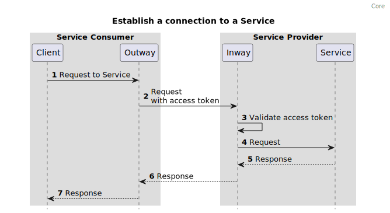

# Architecture

This chapter describes the basic architecture of an FSC system.

## Identity and Trust  {#trustanchor}

Connections between Managers, Inways, Outways use Mutual Transport Layer Security (mTLS) with X.509 certificates. 
Components in the Group are configured to accept the same (Sub-) Certificate Authorities (CA) as defined in the Trust Anchors list (TA). Each TA is a Trusted Third Party that ensures the identity of the Peers by verifying a set of fields of the subject field , [section 4.1.2.6](https://rfc-editor.org/rfc/rfc5280) of [[RFC5279]] that act as [PeerID](#peer_id) in each X.509 certificate.
When multiple TAs are used the TAs must ensure that the elements of the subject field used to identify a Peer are the same across the TAs. 

## Contract Management

Contracts are negotiated between the Managers of Peers. A Directory provides the address of each Manager.
Connections to Services are authorized by Contracts with ServiceConnectionGrants. To create a new contract, the Manager uses a selection of desired connections as input. (Typically this input comes from a user interface interacting with the Management functionality). For each desired connection, a ServiceConnectionGrant is formulated that contains identifying information about both the Outway from the Service consumer and the Service of the Service provider. One Contract may contain multiple Grants. Grants typically match the connections mentioned in a legal agreement like a Data Processing Agreement (DPA). Valid Contracts are used to configure Inways and Outways and enable the possibility to automatically create on demand connections between Peers, as defined in the Grants.
Contracts can contain multiple Peers. E.g. if a Peer wants a single Contract for an application, this Contract can contain all the connections required for that application.

1. The initiating Peer gets the address of the Manager from a Directory.
2. The Directory return the Manager address to the Peer.
3. The initiating Peer sends the Contract proposal with its accept signature to the receiving Peer.
4. The receiving Peer sends back its own accept signature to the initiating Peer.

### Contract states

Any Peer can submit a Contract to other Peers. This Contract becomes valid when the Peers mentioned in the Contract accept the Contract by placing an accept signature. 

A Contract becomes invalid when at least one Peer mentioned in the Contract revokes the Contract.

A Contract becomes invalid when at least one Peer mentioned in the Contract rejects the Contract.

A Contract becomes invalid when the validity period of the Contract expires.

Accepting, rejecting and revoking is done by adding a digital signature.

The content of a Contract is immutable. When the content of a Contract is subject to change, the Contract is invalidated and replaced by a new one.

## Creating a Group

A Group is a system of Peers using Inways, Outways and Managers that confirm to the FSC specification to make use of each other's Services. 

In order to create a Group, additional [Group Rules & Restrictions](#group_rules) containing at least the mandatory decisions **MUST** be created.

## Service discovery

Every Group is defined by at least one Directory, which contains the Services and Peers in the Group.
Peers can make themselves known to a Directory by having their Manager call the [Announce](#announce) endpoint of the Directory. 

When publishing services, Managers register Services by offering Contracts with a [ServicePublicationGrant](#service_publication_grant) or [DelegatedServicePublicationGrant](#grant_delegated_service_publication) to the Directory.

Peers query the Directories to discover the Services available in the Group 

1. The Peer creates a Contract with a Service Publication Grant which contains the details of the Service.
2. The Peer adds its own accept signature to the Contract. 
3. The Peer sends the Contract and accept signature to the Directory.
4. The Directory adds its own accept signature.
5. The Directory sends the accept signature to the Peer. 

## Create an authorization to connect to a Service

A connection can be established if the Peer connecting to the Service has a valid Contract containing a [ServiceConnectionGrant](#service_connection_grant) with the Peer providing the Service.
The connection Grants contains information about the Service and the public key of the Outway that is authorized to connect to the Service.

The Contract is distributed among the two Peers. Once the Contract is signed by all Peers, the Outway can connect to the Inway offering the Service.

1. The Service consumer creates a Contract with a Service Connection Grant which contains the details of the Service.
2. The Service consumer adds an accept signature to the Contract.
3. The Service consumer sends the Contract and the accept signature to the Service Provider.
4. The Service provider adds its own accept signature.
5. The Service provider sends the accept signature to the Service consumer.

When the Service is being offered on behalf of another Peer the Contract is distributed among three Peers. The Peer acting as Delegator in the Service publication will also receive the Contract.
Once the Contract is signed by all the Peers, the Outway can connect to the Inway offering the Service on behalf the Delegator. 

1. The Service consumer creates a Contract with a Service Connection Grant which contains the details of the Service.
2. The Service consumer adds an accept signature to the Contract.
3. The Service consumer sends the Contract and the accept signature to the Service provider.
4. The Service consumer sends the Contract and the accept signature to the Delegator of Service Publication.
5. The Service provider adds its own accept signature.
6. The Service provider sends the accept signature to the Service consumer.
7. The Service provider sends the accept signature to the Delegator.
8. The Delegator adds its own accept signature.
9. The Delegator sends the accept signature to the Service provider.
10. The Delegator sends the accept signature to the Service consumer.

## Delegate the authorization to connect to a Service

### A delegated service connection

A connection on behalf of another Peer (delegation) can only be established if the Peer connecting to the Service has a valid Contract containing a [DelegatedServiceConnectionGrant](#grant_delegated_service_connection) with the Peer providing the Service.
The connection Grants contains information about the Service, the public key of the Outway that is authorized to connect to the Service and the Peer acting as Delegator.

The Contract is distributed among the three Peers. Once the Contract is signed by all the Peers, the Outway of the Delegatee can connect to the Inway offering the Service on behalf the Delegator.

1. The Delegator creates a Contract with a Delegated Service Connection Grant which contains the details of the Service and the Peer who will be acting as Delegatee (who will consume the Service).
2. The Delegator adds its own accept signature to the Contract.
3. The Delegator sends the Contract and accept signature to the Delegatee.
4. The Delegatee adds its own accept signature.
5. The Delegatee sends the accept signature to the Delegator.
6. The Delegatee sends the accept signature to the Service Provider.
7. The Delegator sends the Contract and accept signature to the Service Provider.
8. The Service Provider adds its own accept signature.
9. The Service Provider sends the accept signature to the Delegatee.
10. The Service Provider sends the accept signature to the Delegator.

### Combining a delegated service publication with a delegated service connection

When the Service is being offered on behalf of another Peer the Contract is distributed among four Peers. The Peer acting as Delegator in the Service publication will also receive the Contract.
Once the Contract is signed by all the Peers, the Outway of the Delegatee can connect to the Inway offering the Service on behalf the Delegator.

1. The Delegator creates a Contract with a Delegated Service Connection Grant which contains the details of the Service and the Peer who will be acting as Delegatee (who will consume the Service).
2. The Delegator adds its own accept signature to the Contract.
3. The Delegator sends the Contract and accept signature to the Delegatee.
4. The Delegator sends the Contract and accept signature to the Service provider.
5. The Delegator sends the Contract and accept signature to the Delegator of the Service publication.
6. The Delegatee adds its own accept signature.
7. The Delegatee sends the accept signature to the Delegator.
8. The Delegatee sends the accept signature to the Service provider.
9. The Delegatee sends the accept signature to the Delegator of the Service publication.
10. The Service provider adds its own accept signature.
11. The Service provider sends the accept signature to the Delegatee.
12. The Service provider sends the accept signature to the Delegator.
13. The Service provider sends the accept signature to the Delegator of the Service publication.
14. The Delegator of the Service publication adds its own accept signature.
15. The Delegator of the Service publication sends the accept signature to the Delegatee.
16. The Delegator of the Service publication sends the accept signature to the Delegator.
17. The Delegator of the Service publication sends the accept signature to the Service provider.

## Consuming a Service

A Peer can consume a Service by sending request for said Service to an Outway. 
The Peer obtains an access token from the Manager of the Peer providing the Service. 
The Outway proxies the request including the access token to the Inway.
The Inway will validate the access token and proxy the request to the Service.

1. The client application sends a request to the Outway.
2. The Outway creates an connection with the Inway and proxies the request. In this diagram it is assumed that the Outway already has an access token. 
3. The Inway validates the provided access token before proxying the request to the Service.
4. The Inway proxies the request to the Service.
5. The Service returns the response to the Inway.
6. The Inway returns the response to the Outway.
7. The Outway returns the response to the client.

## Use cases and required components

Which components a Peer needs depends on the use case.

A Peer who wants to consume Services needs a Manager and an Outway.  

A Peer who wants to offer Services needs a Manager and an Inway.    

A Peer who wants to both consume and offer Services needs a Manager,an Outway and an Inway.  
