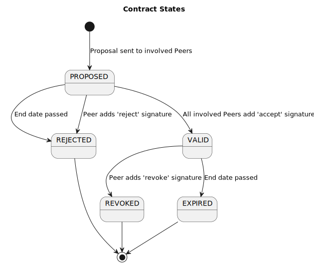

# Architecture

This chapter describes the basic architecture of an FSC system.

## Identity and Trust  {#trustanchor}

Connections between Managers, Inways, Outways use Mutual Transport Layer Security (mTLS) with X.509 certificates. 
Components in the Group are configured to accept the same (Sub-) Certificate Authorities (CA) as Trust Anchors (TA). Each TA is a Trusted Third Party that ensures the identity of the Peers by verifying a set of fields of the subject field , [section 4.1.2.6](https://rfc-editor.org/rfc/rfc5280) of [[RFC5279]] that act as [PeerID](#peer_id) in each X.509 certificate.
When multiple TAs are used the TAs must ensure that the elements of the subject field used to identify a Peer are the same across the TAs. 

## Contract Management

Contracts are negotiated between the Managers of Peers. The Directory provides the address of each Manager.
Connections to Services are authorized by Contracts with ServiceConnectionGrants. To create a new contract, the Manager uses a selection of desired connections as input. (Typically this input comes from a user interface interacting with the Management functionality, see [Registering a Peer](#registering_a_peer)). For each desired connection, a ServiceConnectionGrant is formulated that contains identifying information about both the Outway from the requesting Peer and the Service of the Providing Peer. One Contract may contain multiple Grants. Grants typically match the connections mentioned in a legal agreement like a Data Processing Agreement (DPA). Valid Contracts are used to configure Inways and Outways and enable the possibility to automatically create on demand connections between Peers, as defined in the Grants.

### Contract states

Any Peer can submit a Contract to other Peers. This Contract becomes valid when the Peers mentioned in the Contract accept the Contract by placing an accept signature. 

A Contract becomes invalid when at least one Peer mentioned in the Contract revokes the Contract.

A Contract becomes invalid when at least one Peer mentioned in the Contract rejects the Contract.

Accepting, rejecting and revoking is done by adding a digital signature.

The content of a Contract is immutable. When the content of a Contract is subject to change, the Contract is invalidated and replaced by a new one.

## Creating a Group

A Group is a system of Peers using Inways, Outways and Managers that confirm to the FSC specification to make use of each other's Services. 

In order to create a Group the following steps **MUST** be taken:

1. Select a [Trust Anchor](#trust_anchor)
2. Select a [Group ID](#group_id)
3. Select what determines the [Peer ID](#peer_id)
4. Select what determines the [Peer name](#peer_name)
5. Select a Peer who acts as the [Directory](#directory) of the Group

## Registering a Peer {#registering_a_peer}

The Peer registration is required to validate that the Peer meets the requirements set by the Group. In case of FSC Core only an X.509 Certificate signed by the TA is required but extensions on Core might, for example, require the Peer to sign a "Terms of Service" document before allowing a Peer to participate in a Group.

To register, the Peer needs to create a Contract with a [PeerRegistrationGrant](#peer_registration_grant). The PeerRegistrationGrant contains information about the Peer, the address of the Manager of the Peer and the Directory that should accept the registration.

Once the Contract between Peer and Directory is signed by both parties, the Peer is considered a Peer of the Group.

## Service discovery

Every Group is defined by one Directory that contains the Services and Peers in the Group.
Managers register Services by offering Contracts with a [ServicePublicationGrant](#service_publication_grant) to the Directory.
Peers query the Directory to discover the Services available in the Group 

## Create an authorization to connect to a Service

A connection can only be established if the Peer connecting to the Service has a valid Contract containing a [ServiceConnectionGrant](#service_connection_grant) with the Peer providing the Service.
The ServiceConnectionGrant contains information about the Service and the certificate of the Outway that is authorized to connect to the Service.

Once the Contract between providing Peer and consuming Peer is signed by both parties, the connection between Inway and Outway can be established.

## Consuming a Service

A Peer can consume a Service by sending request for said Service to an Outway. 
The Peer obtains an access token from the Manager of the Peer providing the Service. 
The Outway proxies the request including the access token to the Inway.
The Inway will validate the access token and proxy the request to the Service.

## Use cases and required components

Which components a Peer needs depends on the use case.

A Peer who wants to consume Services needs a Manager and an Outway.  

A Peer who wants to offer Services needs a Manager and an Inway.    

A Peer who wants to both consume and offer Services needs a Manager,an Outway and an Inway.  
