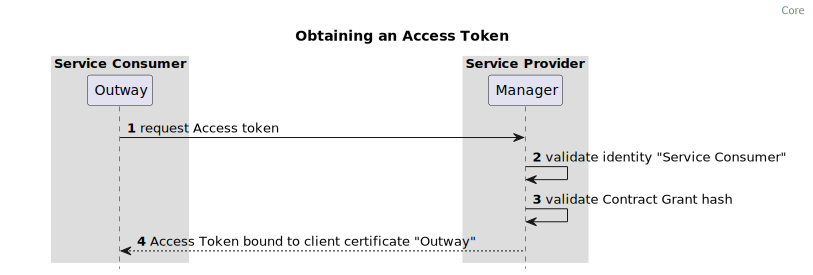

# Specifications

## Protocols

The Manager **MUST** support HTTP/1.1[[RFC9112]].

The Manager **MAY** support HTTP/2[[RFC9113]]. 

The protocol used between the Inway and Outway can be either HTTP/1.1[[RFC9112]] or HTTP/2[[RFC9113]]. The protocol is determined by the `protocol` field of a Service as specified in the object `.components/schemas/serviceListingService` of the [OpenAPI Specification](https://gitlab.com/commonground/standards/fsc/-/raw/master/manager.yaml).

### Port configuration

In order to provide a predictable network configuration FSC limits the selection of network ports to be used by components. 
The ports used by FSC components **MUST** be `443` or `8443`. 

Port `443` is **RECOMMENDED** for data traffic i.e. HTTP requests to a Service.  
Port `8443` is **RECOMMENDED** for management traffic i.e. submitting/signing Contracts.  

Data traffic: Inway, Outway  
Management Traffic: Directory, Manager

### Group ID {#group_id}

The Group ID is the identifier of the Group. This identifier is chosen by the Group upon creation of the Group.  
The Group ID **MUST** match the following regular expression `^[a-zA-Z0-9./_-]{1,100}$`

### Peer ID {#peer_id}

Each Peer **MUST** have a unique identifier within the Group, this identifier is called the PeerID. The PeerID is determined by at least one element from the subject field [section 4.1.2.6](https://rfc-editor.org/rfc/rfc5280) of [[RFC5280]] of an X.509 certificate. Each Group **MUST** define which element(s) of the subject field of the X.509 certificate act as PeerID.
The TA(s) issuing the certificates must ensure that PeerID is always the same for a Peer in each issued certificate for said Peer.    

### Peer name {#peer_name}

Each Peer **MUST** have a human-readable name which can be used to identify a Peer. Unlike the PeerID the name does not have to be unique. The name of Peer is determined by an element in the subject field [section 4.1.2.6](https://rfc-editor.org/rfc/rfc5280) of [[RFC5280]] of an X.509 certificate. The Group **MUST** define which element of the subject field is used.

### Trust Anchor {#trust_anchor}

The Trust Anchor (TA) is an authoritative entity for which trust is assumed and not derived. In the case of FSC, which uses an X.509 architecture, it is the root certificate from which the whole chain of trust is derived.

Each Group can have multiple TAs.

Every Peer in a Group **MUST** accept the same TA(s).

The TA **SHOULD** validate a Peers identity, i.e. the TA **MUST** preform Organization Validation.

### TLS configuration {#tls_configuration}

Connections between Inways, Outways, Managers of a Group are mTLS connections based on X.509 certificates as defined in [[RFC5280]].

The certificate guarantees the identity of a Peer.

FSC places specific requirements on the subject fields of a certificate. [section 4.1.2.6](https://www.rfc-editor.org/rfc/rfc5280#section-4.1.2.6) of[[RFC5280]] which are listed below

- Subject Alternative Name [section 4.1.2.6](https://www.rfc-editor.org/rfc/rfc5280#section-4.1.2.6) of[[RFC5280]]: This should contain the Fully Qualified Domain Names (FQDN) of a Manager, Inway or Outway. For an Outway this FQDN does not have to resolve externally.
- Subject Organization: This should contain to the name of the Organization.

The representation and verification of domains specified in the X.509 certificate **MUST** adhere to [[RFC6125]]

#### TLS Version

The TLS versions used between Peers in a Group **MUST** be defined in the additional [Group Rules & Restrictions](#group_rules).

#### Certificate & Public key thumbprints {#certificate_thumbprints}

FSC differentiates between two different types of thumbprints, often also called fingerprints. *Certificate* thumbprints and *Public Key* thumbprints.

Public Key thumbprints are used in FSC contracts, this enables the renewal of the certificate without invalidating the contract, since the Public Key thumbprint remains the same between Certificate renewals.
Certificate thumbprints are used in the certificate-bound access tokens [section 3](https://www.rfc-editor.org/rfc/rfc8705#section-3) of [[RFC8705]]. FSC uses certificate-bound access tokens to authorize a connection to a Service. Certificate thumbprints are always part of a X.509 certificate and **MUST** be created as described in [section 4.1.8](https://www.rfc-editor.org/rfc/rfc7515#section-4.1.8) of [[RFC7515]].

Within FSC both *Certificate thumbprints* and *Public Key* thumbprints uses the `sha256` thumbprint. 

###  Error Handling {#error_handling}

The Inway and Outway both have a single endpoint which proxies HTTP requests. 
In case of an error within the scope of FSC these components **MUST** return the HTTP header `Fsc-Error-Code` which **MUST** contain the code specifying the error. 

The response body must contain an object as described in `.components/schemas/error` of the [OpenAPI Specification](https://gitlab.com/commonground/standards/fsc/-/raw/master/manager.yaml).  

The HTTP status codes that **MUST** be used in combination with the HTTP header `Fsc-Error-Code` are defined in the sections 3.7.1.4 and 3.8.2.2.

## Contracts

The content of a Contract is defined in the object `.components/schemas/contractContent` of the [OpenAPI Specification](https://gitlab.com/commonground/standards/fsc/-/raw/master/manager.yaml)

example Contract with a ServiceConnectionGrant
```json
{
  "content": {
    "iv": "06338364-8305-7b74-8000-de4963503139",
    "group_id": "fsc-example-group",
      "validity": {
        "not_before": 1672527600,
        "not_after": 1704063600
    },
    "grants": [
      {
        "data": {
          "type": "GRANT_TYPE_SERVICE_CONNECTION",
          "service": {
            "peer_id": "00000000000000000001",
            "name": "example-service"
          },
          "outway": {
            "peer_id": "00000000000000000002",
            "public_key_thumbprint": "3a56f2e9269ac63f0d4394c46b96539da1625b6a985d38029ff89f34e490960c"
          }
        }
      }
    ],
    "hash_algorithm": "HASH_ALGORITHM_SHA3_512",
    "created_at": 1672527600
  }
}
```

### Contract Validation {#contract_validation}

- A UUID **MUST** be provided in the field `contract.iv`. The value must be unique. Each Peer is responsible for ensuring that only one Contract can exist with a given `iv`. 
- A hash algorithm is provided in the field `contract.content.hash_algorithm`.
- The date provided in `contract.content.created_at` can not be in the future.
- The Group ID of the Manager matches the Group ID defined in the field `contract.group_id`.
- A valid date is provided in `contract.content.validity.not_before`. 
- A valid date is provided in `contract.content.validity.not_after`.
- The date provided in `contract.content.validity.not_after` must be greater than the date provided in the field `contract.validity.not_before`.
- The date provided in `contract.content.validity.not_after` must be in the future.
- At least one Grant is set in the field `contract.content.grants`.
- A `ServicePublicationGrant` or `DelegatedServicePublicationGrant` cannot be mixed with other Grants. Mixing Grant types with different use-cases is prohibited to prevent the creation of Contracts that are hard to maintain and validate.

Per Grant type different validation rules apply.

#### ServicePublicationGrant {#service_publication_grant}

The content of a ServicePublicationGrant is defined in the object `.components/schemas/grantServicePublication` of the [OpenAPI Specification](https://gitlab.com/commonground/standards/fsc/-/raw/master/manager.yaml)

Validation rules:

- The Peer ID provided by the X.509 certificate used by the Manager of the Directory Peer matches the value of the field `grant.data.directory.peer_id`
- The Peer ID provided by the X.509 certificate used by the Manager offering the Contract to the Directory matches the value of the field `grant.data.service.peer_id`
- A Service name which matches the regular expression `^[a-zA-Z0-9-._]{1,100}$` is provided in the field  `grant.data.service.name` 

Signature requirements:  

- A signature is present with the Peer ID of the Peer defined in the field `grant.data.directory.peer_id`
- A signature is present with the Peer ID of the Peer defined in the field `grant.data.service.peer_id`

### DelegatedServicePublicationGrant  {#grant_delegated_service_publication}

*The Delegatee is the Peer specified in `grant.data.service.peer_id`*
*The Delegator is the Peer specified in `grant.data.delegator.peer_id`*

Validation rules:

- The Peer ID provided by the X.509 certificate used by the Manager creating the delegation matches the value of the field `grant.data.delegator.peer_id`
- The Peer ID provided by the X.509 certificate used by the Manager of the Directory Peer matches the value of the field `grant.data.directory.peer_id`
- The Peer ID provided by the X.509 certificate used by the Manager providing the Service matches the value of the field `grant.data.service.peer_id`
- The validation rules of the field `Service` of the ServicePublicationGrant described in Core must be applied to the field `grant.data.service` of the DelegatedServicePublicationGrant

Signature requirements:

- A signature is present with the subject serial number of the Peer defined the field `grant.data.service.peer_id`
- A signature is present with the subject serial number of the Peer defined the field `grant.data.directory.peer_id`
- A signature is present with the subject serial number of the Peer defined the field `grant.data.delegator.peer_id`

#### ServiceConnectionGrant {#service_connection_grant}

The content of a ServiceConnectionGrant is defined in the object `.components/schemas/grantServiceConnection` of the [OpenAPI Specification](https://gitlab.com/commonground/standards/fsc/-/raw/master/manager.yaml)

Validation rules:

- The Peer ID provided by the X.509 certificate used by the Manager of the Peer providing the Service matches the value of the field `grant.data.service.peer_id`
- The Peer ID provided by the X.509 certificate used by the Manager offering the Contract to the Service providing Peer matches the value of the field `grant.data.outway.peer_id`
- The Service provided in the field `grant.data.service.name` is offered by the Peer provided in the field `grant.data.service.peer_id`
- A Public key fingerprint also called thumbprint is provided in the field `grant.data.outway.public_key_thumbprint`

Signature requirements:

- A signature is present with the Peer ID of the Peer defined in the field `grant.data.outway.peer_id`
- A signature is present with the Peer ID of the Peer defined in the field `grant.data.service.peer_id`

### DelegatedServiceConnectionGrant {#grant_delegated_service_connection}

*The Delegatee is the Peer specified in `grant.data.outway.peer_id`*
*The Delegator is the Peer specified in `grant.data.delegator.peer_id`*

Validation rules:

- The Peer ID provided by the X.509 certificate used by the Manager of the Peer creating the delegation matches the value of the field `grant.delegator.peer_id`
- The Peer ID provided by the X.509 certificate used by the Manager consuming the DelegatedServiceConnectionGrant matches with the value of the field `grant.outway.peer_id`
- The Peer ID provided by the X.509 certificate used by the Manager of the Peer providing the Service matches with the value of the field `grant.data.service.peer_id`
- The validation rules of the fields `Outway` and `Service` of the ServiceConnectionGrant described in Core must be applied to corresponding fields `grant.data.outway` and `grant.data.service` of the DelegatedServiceConnectionGrant
- In case of a Service that is published on behalf of another Peer, The Peer ID provided by the X.509 certificate used by the Manager of the Peer delegating the publication of Service matches with the value of the field `grant.data.service.delegator.peer_id`

Signature requirements:

- A signature is present with the subject serial number of the Peer defined the field `grant.data.outway.peer_id`
- A signature is present with the subject serial number of the Peer defined the field `grant.data.delegator.peer_id`
- A signature is present with the subject serial number of the Peer defined the field `grant.data.service.peer_id`
- In case of a Service that is published on behalf of another Peer, a signature is present with the subject serial number of the Peer defined the field `grant.data.service.delegator.peer_id`

### Signatures {#signatures}

A signature **MUST** follow the JSON Web Signature (JWS) format specified in [[RFC7515]]

A signature on a Contract **SHOULD** only be accepted if the Peer is present in one of the Grants as:

*ServicePublicationGrant*

- `grant.data.directory.peer_id`
- `grant.data.service.peer_id`

*DelegatedServicePublicationGrant*

- `grant.data.directory.peer_id`
- `grant.data.service.peer_id`
- `grant.data.delegator.peer_id`

*ServiceConnectionGrant*

- `grant.data.outway.peer_id`
- `grant.data.service.peer_id`
- `grant.data.service.delegator.peer_id`

*DelegatedServiceConnectionGrant*

- `grant.data.outway.peer_id`
- `grant.data.service.peer_id`
- `grant.data.delegator.peer_id`
- `grant.data.service.delegator.peer_id`

The JWS **MUST** specify the certificate thumbprint of the keypair used to create the digital signature using the `x5t#S256` [section 4.1.8](https://www.rfc-editor.org/rfc/rfc7515#section-4.1.8) of [[RFC7515]] field of the `JOSE Header` [section 4](https://www.rfc-editor.org/rfc/rfc7515#section-4) of [[RFC7515]].

The JWS **MUST** use the JWS Compact Serialization described in [section 7.1](https://www.rfc-editor.org/rfc/rfc7515#section-7.1) of [[RFC7515]]

The JWS **MUST** be created using one of the following digital signature algorithms:

* RS256
* RS384
* RS512
* ES256
* ES384
* ES512

The JWS Payload as defined in [section 2](https://www.rfc-editor.org/rfc/rfc7515#section-2) of [[RFC7515]], **MUST** contain a hash of the `contract.content` as described in the section [Content Hash](#content_hash), one of the signature types described in the [signature type section](#signature_types) and a Unix timestamp of the sign date.

JWS Payload example:
```JSON
{
  "contract_content_hash": "--------",
  "type": "accept",
  "signed_at": 1672527600
}
```

#### Payload fields

- `contract_content_hash`, hash of the content of the Contract.
- `type`, type of signature.
- `signed_at` Unix timestamp of the sign date.

#### Signature types {#signature_types}

- `accept`, Peer has accepted the contract
- `reject`, Peer has rejected the contract
- `revoke`, Peer has revoked the contract


### The content hash {#content_hash}

A Peer should ensure that a signature is intended for the Contract.  
This validation is done by comparing the hash of the received Contract with the hash in the signature.  
The Validation **MUST** be done every time a Peer receives a signature.  

The `contract_content_hash` of the signature payload contains the signature hash. The algorithm to create a `contract_content_hash` is described below. 
The algorithm ensures that the content hash is unique for a specific Contract content. Because a signature contains the content hash it becomes possible to guarantee that a signature is intended for a specific Contract.

1. Create a byte array called `contentBytes`.
1. Convert `contract.content.group_id` to bytes and append the bytes to `contentBytes`.
1. Append `contract.content.iv` to `contentBytes`.
1. Convert `contract.content.validity.not_before` to bytes and append the bytes to `contentBytes`.
1. Convert `contract.content.validity.not_after` to bytes and append the bytes to `contentBytes`.
1. Convert `contract.content.created_at` to bytes and append the bytes to `contentBytes`.
1. Create an array of bytes arrays called `grantByteArrays`
1. For each Grant in `contract.content.grants`
   1. Create a Grant Hash for the Grant as documented in the [Grant Hash section](#grant_hash).
   1. Convert the Grant Hash from string to bytes and store them in a byte array named `grantBytes`.
   1. Append `grantBytes` to `grantByteArrays`.
1. Sort the byte arrays in `grantByteArrays` in ascending order.
1. Append the bytes of `grantByteArrays` to `contentBytes`.
1. Hash the `contentBytes` using the hash algorithm described in `contract.content.algorithm`.
1. Encode the bytes of the hash using Base64 URL encoding with all trailing '=' characters omitted and without the inclusion of any line breaks, whitespace, or other additional characters.
1. Convert the value of `contract.content.algorithm` to an int32 and surround it with dollar signs (`$`). When using the `SHA3-512` algorithm this would result in `$1$`. 
   To convert the hash algorithm to an integer see the [type mapping](#type_mapping_hash_algorithm)
1. Add `1$` as suffix to the string created in step 13. This is the enum `HASH_TYPE_CONTRACT` as defined in the field `.components.schemas.HashType` of [the OpenAPI Specification](https://gitlab.com/commonground/standards/fsc/-/raw/master/manager.yaml) as int32. If the string created in step 13 is `$1$`, the result should now be `$1$1$`
1. Add the Base64 generated in step 12 as suffix to the string generated in step 14.

#### Data types {#data_types}

- `int32`: use `Little-endian` as endianness when converting to a byte array
- `int64`: use `Little-endian` as endianness when converting to a byte array
- `string`: use `utf-8` encoding when converting to a byte array

### Grant hash {#grant_hash}

The Grant hash is used in the access token request to identify the Contract and Grant which contain the authorization for the connection to the Service. 
The `iv` (Initialization vector) field is included in the Grant hash to create a Grant hash that references to a single Contract. 
The Grant hash can be created by executing the following steps:

1. Create a byte array named `grantBytes`
1. Convert `contract.content.group_id` to bytes and append the bytes to `grantBytes`.
1. Convert `contract.content.iv` to bytes and append the bytes to `grantBytes`.
1. Convert the value of each field of the Grant to bytes and append the bytes to the `grantBytes` in the same order as the fields are defined in [the OpenAPI Specification](https://gitlab.com/commonground/standards/fsc/-/raw/master/manager.yaml).
   To convert the Grant type to an integer see the [type mapping](#type_mapping_grant) 
1. Hash the `grantBytes` using the hash algorithm described in `contract.content.algorithm`
1. Encode the bytes of the hash using Base64 URL encoding with all trailing '=' characters omitted and without the inclusion of any line breaks, whitespace, or other additional characters.
1. Convert the value of `contract.content.algorithm` to an int32 and enclose it with `$`. The int32 value per hash algorithm type is defined in the [type mapping](#type_mapping_hash_algorithm).. E.g. The enum `HASH_ALGORITHM_SHA3_512` becomes `$1$`.
1. Determine the `HashType` that matches with value of `Grant.type` and convert it to an int32 and add a `$` as suffix. The int32 value per hash type is defined in the [type mapping](#type_mapping_hash). E.g. The enum `HASH_TYPE_SERVICE_PUBLICATION_GRANT` becomes `2$`.
1. Combine the strings containing the hash algorithm (step 6) and Hash type (step 7). E.g. The hash algorithm `HASH_ALGORITHM_SHA3_512` and Grant Type `GRANT_TYPE_SERVICE_CONNECTION` should result in the string `$1$2$`
1. Prefix the Base64 string generated in step 5 with the string generated in step 8.

### Type mappings

#### Hash types {#type_mapping_hash}

| Hash type                                     | int32 value |
|-----------------------------------------------|-------------|
| HASH_TYPE_CONTRACT                            | 1           |
| HASH_TYPE_SERVICE_PUBLICATION_GRANT           | 2           |
| HASH_TYPE_SERVICE_CONNECTION_GRANT            | 3           |
| HASH_TYPE_DELEGATED_SERVICE_CONNECTION_GRANT  | 4           |
| HASH_TYPE_DELEGATED_SERVICE_PUBLICATION_GRANT | 5           |

#### Grant types {#type_mapping_grant}

| Hash type                                | int32 value |
|------------------------------------------|-------------|
| GRANT_TYPE_SERVICE_PUBLICATION           | 1           |
| GRANT_TYPE_SERVICE_CONNECTION            | 2           |
| GRANT_TYPE_DELEGATED_SERVICE_CONNECTION  | 3           |
| GRANT_TYPE_DELEGATED_SERVICE_PUBLICATION | 4           |

#### Hash algorithms {#type_mapping_hash_algorithm}

| Hash Algorithm          | int32 value |
|-------------------------|-------------|
| HASH_ALGORITHM_SHA3_512 | 1           |

#### Service types {#type_mapping_service}

| Service Type                   | int32 values |
|--------------------------------|--------------|
| SERVICE_TYPE_SERVICE           | 1            |
| SERVICE_TYPE_DELEGATED_SERVICE | 2            |


## Access token {#access_token}

The access token is a JSON Web Token (JWT) as specified in [[RFC7519]]

The JWT **MUST** specify the thumbprint of the X.509 certificate used to sign the JWT using the `x5t#S256` [section 4.1.8](https://www.rfc-editor.org/rfc/rfc7515#section-4.1.8) of [[RFC7515]] field of the `JOSE Header`  [section 4](https://www.rfc-editor.org/rfc/rfc7515#section-4) of [[RFC7515]].

The JWT **MUST** be created using one of the following digital signature algorithms:

* RS256
* RS384
* RS512
* ES256
* ES384
* ES512

The access token is a certificate-bound access token as specified in [section 3](https://www.rfc-editor.org/rfc/rfc8705#section-3) of [[RFC8705]]

### JWT Payload

The payload of the JWT:

* *gth(string):*  
  The hash of the Grant that serves as basis for the authorization
* *gid(string):*
  The ID of the Group
* *sub(string):*
  The subject [section 4.1.2](https://www.rfc-editor.org/rfc/rfc7519#section-4.1.2) of [[RFC7519]]. This should be the ID of the Peer for whom the token is intended 
* *iss(string):*
  The issuer [section 4.1.1](https://www.rfc-editor.org/rfc/rfc7519#section-4.1.1) of [[RFC7519]]. The ID of the Peer who issued the token. I.e. the Peer who is offering the Service
* *svc(string):*
  Name of the Service
* *aud(string):*
  The audience [section 4.1.3](https://www.rfc-editor.org/rfc/rfc7519#section-4.1.3) of [[RFC7519]]. This should be URI [[RFC3986]] of the Inway providing the Service. The URI is a URL that **MUST** contain the scheme and port number used by the Inway
* *exp(int):*
  Expiration time [section 4.1.4](https://www.rfc-editor.org/rfc/rfc7519#section-4.1.4) of [[RFC7519]]
* *nbf(int):*
  Not before  [section 4.1.5](https://www.rfc-editor.org/rfc/rfc7519#section-4.1.5) of [[RFC7519]]
* *cnf(object):*
    * *x5t#S256(string):*
    The thumbprint of the certificate that is allowed ot use the access token. [section 3.1] of [[RFC8705]]
* *act(object):*
    * *sub(string):*
      The ID of the Peer connecting to the Service on behalf of another Peer. The field `grant.data.delegator.peer_ID` of the DelegatedServiceConnectionGrant. 
* *pdi(string):*
  The ID of the Peer delegating the publication of the Service to another Peer. The field `grant.data.service.delegator.peer_ID` of the ServiceConnectionGrant or DelegatedServiceConnectionGrant.
* *add(object):*
  An object which can be used to provide additional data 

Example payload of a JWT for a Peer (`sub: 1234567890`) connecting to a Service (`svc: serviceName`) offered by a Peer(`iss: 1234567891`):

```json
{
    "gth": "$1$4$+PQI7we01qIfEwq4O5UioLKzjGBgRva6F5+bUfDlKxUjcY5yX1MRsn6NKquDbL8VcklhYO9sk18rHD6La3w/mg",
    "gid": "fsc.group.example.id",
    "sub": "1234567890",
    "iss": "1234567891",
    "svc": "serviceName", 
    "aud": "https://inway.com",
    "exp": 1493726400,
    "nbf": 1493722800,
    "cnf": {
      "x5t#S256": "DpAyDYakmVAQ4oOJC3UYLRk/ONRCqMj00TeGJemMiLA"
    },
    "add": {}
}
```

Example payload of a connection of a Peer (`sub: 1234567890`) to a Service (`svc: serviceName`) offered by a Peer (`iss: 1234567891`) on behalf of another Peer(`pdi: 1234567892`):

```json
{
    "gth": "$1$4$+PQI7we01qIfEwq4O5UioLKzjGBgRva6F5+bUfDlKxUjcY5yX1MRsn6NKquDbL8VcklhYO9sk18rHD6La3w/mg",
    "gid": "fsc.group.example.id",
    "sub": "1234567890",
    "iss": "1234567891",
    "pdi": "1234567892",
    "svc": "serviceName", 
    "aud": "https://inway.com",
    "exp": 1493726400,
    "nbf": 1493722800,
    "cnf": {
      "x5t#S256": "DpAyDYakmVAQ4oOJC3UYLRk/ONRCqMj00TeGJemMiLA"
    },
    "add": {}
}
```

Example payload for a JWT of a Peer (`act.sub: 1234567892`) who is connecting on behalf of Peer (`sub: 1234567890`) to a Service (`svc: serviceName`) offered by a Peer (`iss: 1234567891`):

```json
{
    "gth": "$1$4$+PQI7we01qIfEwq4O5UioLKzjGBgRva6F5+bUfDlKxUjcY5yX1MRsn6NKquDbL8VcklhYO9sk18rHD6La3w/mg",
    "gid": "fsc.group.example.id",
    "sub": "1234567890",
    "iss": "1234567891",
    "svc": "serviceName", 
    "aud": "https://inway.com",
    "exp": 1493726400,
    "nbf": 1493722800,
    "act": {
      "sub": "1234567892"
    },
    "cnf": {
      "x5t#S256": "DpAyDYakmVAQ4oOJC3UYLRk/ONRCqMj00TeGJemMiLA"
    },
    "add": {}
}
```

## Manager {#manager}

The Manager is an essential component for each Peer in the Group. 
The Manager is responsible for:

- Receiving Contracts
- Validating Contracts
- Receiving Contract signatures (accept, reject, revoke)
- Validating Contract signatures
- Providing the X.509 certificates of the keypair of which the private key was used by the Peer to create signatures
- Providing Contracts involving a specific Peer
- Providing access tokens 
- Listing Peers
- Listing Services

It is **RECOMMENDED** to implement the Manager functionality separate from the Inway functionality, in order to be able to have multiple Inways that are configured by one Manager.

### Behavior

#### Authentication

The Manager **MUST** only accept mTLS connections from other external Managers with an X.509 certificate that is signed by the TA of the Group.

#### Contracts

The Manager **MUST** support Contracts containing Grants of the type ServicePublicationGrant and ServiceConnectionGrant.

The Manager **MUST** validate Contracts using the rules described in [Contract validation section](#contract_validation)

The Manager **MUST** persist the Peer ID, name and Manager address of each Peer with whom the Peer has negotiated Contracts.

It is **RECOMMENDED** to implement a retry and backoff mechanism in case the Contract propagation fails.

#### Signatures

The Manager **MUST** validate the signature according to the rules described in the [signature section](#signatures).

The Manager **MUST** generate an error response if a signature is invalid.

The Manager **MUST** propagate the signature to each of the Peers in the Contract when the Peer signs the Contract.

It is **RECOMMENDED** to implement a retry and backoff mechanism in case the signature propagation fails.

#### Providing X.509 certificates

The Manager **MUST** provide X.509 certificates of the keypairs used to sign Contracts and access tokens.

The Manager **MUST** provide the complete certificate chain excluding the root CA certificate used by the Group as Thrust Anchor.

#### Providing contracts

The Manager **MUST** provide existing Contracts for a specific Peer. A Contract **SHOULD** only be provided to a Peer if the Peer is present in one of the Grants of the Contract.

#### Tokens{manager_tokens}

The Manager **MUST** be able to provide an [access token](#access_token) to Peers that have a valid Contract containing a ServiceConnectionGrant or DelegatedServiceConnectionGrant.

Before issuing an access token the Manager **MUST** validate that:

1. The `scope` provided in the token request contains a Grant hash that matches with a ServiceConnectionGrant or DelegatedServiceConnectionGrant of a valid Contract. 
1. The `client_id` provided in the token request contains a PeerID that matches with the PeerID specified in the X.509 certificate of the client requesting the access token and later using the access token to make an API request.
1. The Manager is provided by a Peer with the same PeerID as specified in `grant.data.service.peer_id`.
1. The Manager is provided by a Peer who has an Inway which is offering the Service specified in `grant.data.service.name`. 
1. The Peer ID specified by the X.509 certificate of the client requesting the access token matches the value of the field `grant.data.outway.peer_id`.
1. The X.509 certificate provided by the client contains the same public key as specified in `grant.data.outway.public_key_fingerprint`

The `cnf.x5t#S256` claim **MUST** contain the certificate thumbprint of the X.509 certificate provided by the client requesting the token according to [section 3.1] of [[RFC8705]].
The `act` claim **MUST** be set when an access token is generated for a Peer who is connecting to the Service on behalf of another Peer. I.e. the authorization to connect has been granted using a DelegatedServiceConnectionGrant.
The `pdi` claim **MUST** be set when an access token is generated for a Service which is being offered on behalf of another Peer. 

The Manager **MUST** include the address of the Inway in the field `aud` of the access token.

#### Services
 
The name of a Service **MUST** be unique within the scope of a Peer.

The Peer is responsible for checking the uniqueness of a Service name.

#### Service listing

The Manager **MUST** list a Service when a valid Contract containing a ServicePublicationGrant or DelegatedServicePublicationGrant for the Service exists.

#### Peer listing

The Manager **MUST** list the Peers with whom the Peer has negotiated Contracts or who announced themselves to the Peer.

The Manager **MUST** persist the Peer ID, name and Manager address of each Peer with whom the Peer has negotiated Contracts.

The Manager **MUST** persist the Peer ID, name and Manager address of each Peer who called the `announce` endpoint as specified in the [OpenAPI Specification](https://gitlab.com/commonground/standards/fsc/-/raw/master/manager.yaml).

### Announce

The `announce` is used to share the `Manager` address and `Peer` information among Peers. The `announce` is also used by the `Directory` to obtain the `Manager` addresses of all `Peers` in the `Group`. 
Each `Peer` **MUST** call the `announce` endpoint of the Directory to register themselves as participant of the `Group`. 

In addition to announcing to the `Directory` a Manager **SHOULD** call the `announce` endpoint of the Peers with whom the Peer has negotiated Contracts when the address of Manager changes.

### Interfaces {#manager_interface}

The Manager functionality **MUST** implement an HTTP interface as specified in the [OpenAPI Specification](https://gitlab.com/commonground/standards/fsc/-/raw/master/manager.yaml).  

###  FSC manager address 

The Manager is required to include its public address as HTTP Header `Fsc-Manager-Address` in each POST or PUT request sent to another Manager.

### Error response

The Manager implements two error formats 

#### OAuth 2.0 error response

The `/token` endpoint **MUST** return an error response as described in [section 5,2](https://www.rfc-editor.org/rfc/rfc6749#section-5.2) of [[RFC6749]].

#### Other endpoints

The Manager **MUST** return the error response object as described in `.components/schemas/error` of the [OpenAPI Specification](https://gitlab.com/commonground/standards/fsc/-/raw/master/manager.yaml).

The code field of the error response **MUST** contain one of the codes defined as `.components.schemas.ManagerErrorCode` in the [OpenAPI Specification](https://gitlab.com/commonground/standards/fsc/-/raw/master/manager.yaml).  

The domain field of the error response **MUST** be equal to `ERROR_DOMAIN_MANAGER`.  

#### Codes

| Error code                                          | HTTP status code | Description                                                                                                                                         |
|-----------------------------------------------------|------------------|-----------------------------------------------------------------------------------------------------------------------------------------------------|
| ERROR_CODE_INCORRECT_GROUP_ID                       | 422              | The Group ID in the Contract does not match the GroupID of the receiving Manager                                                                    |
| ERROR_CODE_PEER_NOT_PART_OF_CONTRACT                | 422              | The Peer tried to submit or sign a Contract without being a Peer on the Contract                                                                    |
| ERROR_CODE_SIGNATURE_CONTRACT_CONTENT_HASH_MISMATCH | 422              | The Peer tried to submit a signature with a Contract content hash that does not match the Contract                                                  |
| ERROR_CODE_PEER_CERTIFICATE_VERIFICATION_FAILED     | 400              | The Peer provided a x.509 certificate signed by the thrust anchor of the Group but the content is invalid. E.g the Peer ID is in a incorrect format |
| ERROR_CODE_PEER_ID_SIGNATURE_MISMATCH               | 422              | The Peer submitted a signature that includes a Peer ID that does not match the ID of the submitting Peer                                            |
| ERROR_CODE_SIGNATURE_VERIFICATION_FAILED            | 422              | The Peer submitted a signature that could not be verified                                                                                           |
| ERROR_CODE_GRANT_COMBINATION_NOT_ALLOWED            | 422              | The Peer submitted a Contract with a combination of Grants that is not allowed                                                                      |
| ERROR_CODE_URL_PATH_CONTENT_HASH_MISMATCH           | 422              | The Content Hash in the URL path does not match the Content Hash generated from the Contract Content in the request body                            |
| ERROR_CODE_UNKNOWN_HASH_ALGORITHM_HASH              | 422              | The Hash Algorithm in the Contract Content hash or Grant Hash is not supported                                                                      |
| ERROR_CODE_UNKNOWN_ALGORITHM_SIGNATURE              | 422              | The Algorithm in the Signature is not supported                                                                                                     |

## Directory {#directory}

The Directory is a Manager chosen by the Group to act as the Directory. 

The Directory is used by Peers to:

- Discover Services
- Discover Peers
- Publish Services
- Register themselves

### Behavior

#### Service publication

Service publication is accomplished by offering a Contract to the Directory which contains one or more ServicePublicationGrants with each ServicePublicationGrant containing a single Service. Once the Directory and the Peer offering the Service have both signed the Contract, the Service is published in the Directory.

The Directory **MUST** be able to sign Contracts with Grants of the type ServicePublicationGrant.

The Directory **MUST** validate the ServicePublicationGrant in the Contract using the rules described in [ServicePublicationGrant section](#service_publication_grant)

Although multiple ServicePublicationGrants are allowed in a single Contract it is **RECOMMENDED** to limit this to one per Contract. Adding multiple ServicePublicationGrants on a single Contract makes the Contract fragile. If the publication of one Service changes the whole Contract will be invalidated. 

## Outway

The Outway is used by Peers to connect to a Service.      
The Outway functions as a forwarding proxy that is responsible for setting up the connection to the Inway that is offering a Service.  

The Outway is responsible for:

- setting up mTLS connections with Inways
- including a valid access token with each request
- deliver the response from the Service to the client calling the Outway

### Behavior

#### Authentication

The Outway **MUST** use mTLS when connecting to Inways with an X.509 certificate signed by the chosen TA of the Group.

#### Routing

The Outway **MUST** proxy the request to the address of the Inway specified in the field `aud` of the access token.

The Outway **MUST** use an [access token](#access_token) provided by the Peer specified in the `grant.data.service.peer_id` field of the ServiceConnectionGrant.

The Outway **MUST** include an access token in the HTTP header `Fsc-Authorization` when proxying the HTTP request to the Inway.  

The Outway **MUST** validate that the Group ID specified in the claim `gid` of the access token matches the Group ID of the Outway.

The Outway **MUST NOT** alter the path of the HTTP Request.

Clients **MAY** use TLS when communicating with the Outway.

#### Obtaining access tokens

Access tokens are obtained using the Client Credentials flow [section 4,4](https://www.rfc-editor.org/rfc/rfc6749#section-4.4) of [[RFC6749]].
Access tokens **MUST** be obtained by calling the `/token` endpoint defined in the [OpenAPI Specification](https://gitlab.com/commonground/standards/fsc/-/raw/master/manager.yaml).

To request a token via the Client Credentials flow the following information must be sent to the Manager which acts as an Authorization Server:
- GrantHash of a `Service Connection grant` or `Delegated Service Connection grant` provided in the `scope` field.
- PeerID of the `Peer` making the request in the `client_id` field
- `client_credentials` in the `grant_type` field.

The `GrantHash` provided in the request to the Manager acts as a reference to a `Grant` on a `Contract`. 
The Manager (Authorization Server) will perform the verification steps defined in the [token section](#manager_tokens) before providing an access token.

The component retrieving the access token **MUST** use mTLS to authenticate with the Authorization server (Manager) as defined in [section 2.1](https://datatracker.ietf.org/doc/html/rfc8705#section-2.1) of [[RFC8705]].
The component retrieving the access token **MUST** use an X.509 certificate signed by the chosen TA of the Group.
The Manager **MUST** verify this client certificate and issue a token bound to this client certificate according to [section 3](https://www.rfc-editor.org/rfc/rfc8705#section-3).



Which component obtains an access token for a Service is an implementation detail and out of scope for this document.

#### Error response

If the Error has occurred in the Inway or Service the Outway **MUST** return the error without altering the response. 

The Outway **MUST** return an error response defined in the [Error handling section](#error_handling) when the error is produced by the Outway.

The code field of the error response **MUST** contain one of the codes defined as `.components.schemas.OutwayErrorCode` in the [OpenAPI Specification](https://gitlab.com/commonground/standards/fsc/-/raw/master/manager.yaml).

The domain field of the error response **MUST** be equal to `ERROR_DOMAIN_OUTWAY`.

##### Codes

| Error code                          | HTTP status code | Description                                                                                                   |
|-------------------------------------|-----------------|---------------------------------------------------------------------------------------------------------------|
| ERROR_CODE_METHOD_UNSUPPORTED       | 405             | The Outway received a request with an HTTP Method that is not supported. The CONNECT method is not supported. |

## Inway

The Inway is used by Peers to offer a Service to other Peers.  
The Inway is a Reverse proxy that handles incoming connections from Outways and routes the request to the correct Service.

The Inway is responsible for:

- validating access tokens.
- routing requests to the correct Service.
- forwarding the access token to the Service which is being called.
- returning the response from the Service to the Outway.

### Behavior

#### Authentication

The Inway **MUST** only accept connections from Outways using mTLS with an X.509 certificate signed by the chosen TA of the Group.

#### Authorization

The Inway **MUST** validate the access token provided in the HTTP `Fsc-Authorization`.   

The request **MUST** be authorized if the access token meets the following conditions:  

- The access token is signed by the same Peer that owns Inway.
- The access token is used by an Outway that uses the X.509 certificate to which the access token is bound. This is verified by applying the JWT Certificate Thumbprint Confirmation Method specified in [section 3.1](https://datatracker.ietf.org/doc/html/rfc8705#section-3.1) of [[RFC8705]].
- The Service specified in the access token is known to the Inway.
- The Group ID specified in the claim `gid` of the access token matches the Group ID of the Inway.

#### Routing

The HTTP request **MUST** contain the HTTP Header `Fsc-Authorization` which contains the access token obtained by the Outway.

The Inway **MUST** proxy the HTTP request to the Service specified in the field `svc` of the access token.

The Inway **MUST** not delete the HTTP Header `Fsc-Authorization` from the HTTP Request before forwarding the request to the Service.

The security of the connection between the Inway and the Service is out of scope for this document.        

### Interfaces

#### Proxy Endpoint

The HTTP endpoint `/` **MUST** be implemented.

#### Error response

The Inway **MUST** return the error response of a Service to the Outway without altering the response.

The Inway **MUST** return an error response defined in the [Error handling section](#error_handling) when the error is produced by the Inway.

The code field of the error response **MUST** contain one of the codes defined as `.components.schemas.InwayErrorCode` in the [OpenAPI Specification](https://gitlab.com/commonground/standards/fsc/-/raw/master/manager.yaml).

The domain field of the error response **MUST** be equal to `ERROR_DOMAIN_INWAY`.

##### Codes

| Error code                         | HTTP status code | Description                                                                                                                                           |
|------------------------------------|------------------|-------------------------------------------------------------------------------------------------------------------------------------------------------|
| ERROR_CODE_ACCESS_TOKEN_MISSING    | 401              | The HTTP header `Fsc-Authorization` does not contain an access token. In this scenario the HTTP header `WWW-Authenticate` **MUST** be set to `Bearer` |
| ERROR_CODE_ACCESS_TOKEN_INVALID    | 401              | The provided access token is invalid. In this scenario the HTTP header `WWW-Authenticate` **MUST** be set to `Bearer`                                 |
| ERROR_CODE_ACCESS_TOKEN_EXPIRED    | 401              | The provided access token has expired. In this scenario the HTTP header `WWW-Authenticate` **MUST** be set to `Bearer`                                |
| ERROR_CODE_WRONG_GROUP_ID_IN_TOKEN | 403              | The Group ID specified in the access token does not match the ID of the Group of the Inway                                                            |
| ERROR_CODE_SERVICE_NOT_FOUND       | 404              | The Service specified in the access token is not offered by the Inway                                                                                 |
| ERROR_CODE_SERVICE_UNREACHABLE     | 502              | The Inway is unable to reach the Service                                                                                                              |

# References

[OpenAPI Specification](https://gitlab.com/commonground/standards/fsc/-/raw/master/manager.yaml)
