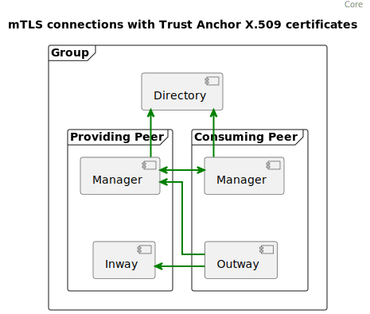
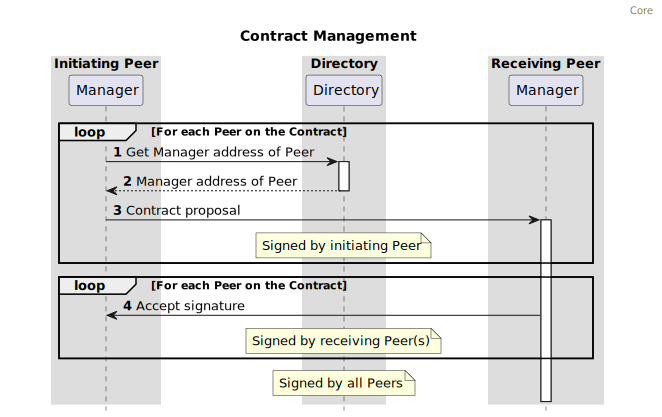
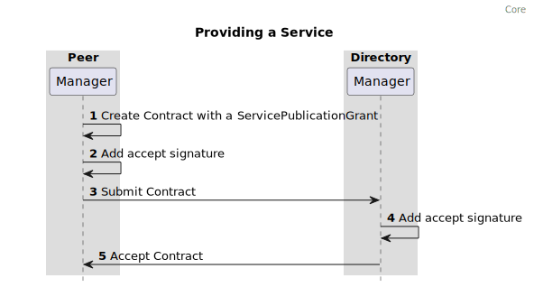

%%%
title = "FSC - core"
abbrev = "FSC - core"
ipr = "trust200902"
submissiontype = "independent"
area = "Internet"
workgroup = ""
keyword = ["Internet-Draft"]

[seriesInfo]
name = "Internet-Draft"
value = "draft-fsc-core-00"
stream = "independent"
status = "informational"
# date = 2022-11-01T00:00:00Z

[[author]]
initials = "E."
surname = "Hotting"
fullname = "Eelco Hotting"
organization = "Hotting IT"
  [author.address]
   email = "rfc@hotting.it"

[[author]]
initials = "R."
surname = "Koster"
fullname = "Ronald Koster"
organization = "PhillyShell"
  [author.address]
   email = "rfc@phillyshell.nl"

[[author]]
initials = "H."
surname = "van Maanen"
fullname = "Henk van Maanen"
organization = "AceWorks"
  [author.address]
   email = "henk.van.maanen@aceworks.nl"

[[author]]
initials = "N."
surname = "Dequeker"
fullname = "Niels Dequeker"
organization = "ND Software"
  [author.address]
   email = "niels@nd-software.be"

%%%

.# Abstract

TODO

{mainmatter}

# Introduction

This section gives an introduction to this RFC.
Section 2 describes the architecture of a system that follows the FSC specification.
Section 3 describes the interfaces and behavior of FSC components in detail.

## Purpose

The Federated Service Connectivity (FSC) specifications describe a way to implement technically interoperable API gateway functionality, covering federated authentication, secure connecting and transaction logging in a large-scale, dynamic API landscape. The standard includes the exchange of information and requests about the management of connections and authorizations, in order to make it possible to automate those activities.

The Core part of the FSC specification achieves inter-organizational, technical interoperability:

- to discover Services
- to route requests to Services in other contexts (e.g. from within organization A to organization B)
- to request and managing connection rights needed to connect to said Services

Functionality required to achieve technical interoperability is provided by APIs as specified in this RFC. This allows for automation of most management tasks, greatly reducing the administrative load and enabling upscaling of inter-organizational usage of services.

## Overall Operation of FSC Core

Peers in a Group announce their HTTP APIs to the Group by publishing them as a Service to the Directory. A Group uses a single Directory that defines the scope of the Group. Peers use the Directory to discover which Services and Peers are available in the Group.
Inways of a Peer expose Services to the Group. 
Outways of a Peer connect to the Inway of a Peer providing a Service.
Contracts define the registration of a Peer to the Group, Service publication to the Group and connections between Peers.

Inways are reverse proxies that route incoming connections from Outways to Services.
Outways are forward proxies that discover all available Services in the Group and route outgoing connections to Inways.
Contract Managers negotiate Contracts between Peers.
Routing information for the Services in the Group can be requested from the Directory.
Tha address of Contracts Managers of Peers can be requested from the Directory.

To connect to a Service, the Peer needs a Contract with a ServiceConnectionGrant that specifies the connection. The FSC Core specification describes how Contracts are created, accepted, rejected and revoked. Once a right to connect is granted through a Contract, a connection from HTTP Client to HTTP Service will be authorized everytime an HTTP request to the HTTPS service is made.

FSC Core specifies the basics for setting up and managing connections in a Group. It is **RECOMMENDED** to use FSC Core with the following extensions, each specified in a dedicated RFC:

- [FSC Delegation](delegation/README.md), to delegate the right to connect to a service

### Use cases

A typical use case is a cooperation of many organizations that use APIs to exchange data or provide business services to each other.

Organizations can participate in multiple FSC Groups at the same time, for example when using different environments for production and test deployments.
Or when participating in different ecosystems, for example health industry and government industry.

An organization can offer the same API in multiple Groups. When doing so, the organization will be a Peer in every Group, and define the API as a Service in the Directory of each Group using a different Inway for each Group.

## Requirements Language

The keywords "MUST", "MUST NOT", "REQUIRED", "SHALL", "SHALL NOT", "SHOULD", "SHOULD NOT", "RECOMMENDED", "NOT RECOMMENDED", "MAY", and "OPTIONAL" in this document are to be interpreted as described in [BCP 14](https://www.rfc-editor.org/info/bcp14) [@!RFC2119] [@!RFC8174] when, and only when, they appear in all capitals, as shown here.

## Terminology

This specification lists terms and abbreviations as used in this document.

*Peer:*    
  
Actor that provides and/or consumes Services. This is an abstraction of e.g. an organization, a department or a security context.

*Group:*   
  
System of Peers using Inways, Outways and Contract Managers that confirm to the FSC specification to make use of each other's Services.

*Directory:*      
  
A Directory holds information about the Services in the FSC Group to make them discoverable.

*Inway:*  
  
Reverse proxy that handles incoming connections to one or more Services.

*Outway:*  
  
Forward proxy that handles outgoing connections to Inways.

*Contract:*  
  
Document between Peers defining which interactions between Peers are possible.

*Contract Manager:*  
  
The Contract Manager manages Contracts and configures Inways and Outways based on information from a Directory and Contracts.

*Grant:*  
  
Defines an interaction between Peers. In FSC Core three Grants are described.  

1. The PeerRegistrationGrant which specifies the right of a Peer to participate as a Peer in the Group.
2. The ServicePublicationGrant which specifies the right of a Peer to publish a Service in the Group.
3. The ServiceConnectionGrant which specifies the right of a Peer to connect to a Service provided by a Peer.

*Service:*      
  
An HTTP API offered to the Group.

*Trust Anchor:*      
  
The Trust Anchor is an authoritative entity for which trust is assumed and not derived. In the case of FSC, which uses an X.509 architecture, it is the root certificate from which the whole chain of trust is derived.

# Architecture

This chapter describes the basic architecture of an FSC system.

## Identity and Trust  {#trustanchor}

Connections between Contract Managers, Inways, Outways and connections with the Directory use Mutual Transport Layer Security (mTLS) with X.509 certificates. Components in the Group are configured to accept the same (Sub-) Certificate Authority (CA) as Trust Anchor. The Trust Anchor is a Trusted Third Party that ensures the identity of all Peers by issuing `Subject.organization` and `Subject.serialnumber` [@!RFC5280, section 4.1.2.6] in each certificate.

!---


!---

## Contract Management

Contracts are negotiated between Contract Managers of Peers. The Directory contains the Contract Manager address of each Peer.
Connections between Peers are based on Contracts with ServiceConnectionGrants. To create a new contract, the Contract Manager uses a selection of desired connections as input. (Typically this input comes from a user interface interacting with the Contract Management functionality, see [Registering a Peer](#registering)). For each desired connection, a ServiceConnectionGrant is formulated that contains identifying information about both the Outway from the requesting Peer and the Service of the Providing Peer. One Contract may contain multiple Grants. Grants typically match the connections mentioned in a legal agreement like a Data Processing Agreement (DPA). Valid Contracts are used to configure Inways and Outways and enable the possibility to automatically create on demand connections between Peers, as defined in the Grants.

!---


!---

### Contract states

Any Peer can submit a Contract to other Peers. This Contract becomes valid when all Peers mentioned in the Contract accept its content by placing an accept signature. 

A Contract becomes invalid when at least one Peer mentioned in de Contract revokes its content.

Accepting, rejecting and revoking is done by adding a digital signature.

Contracts are immutable. When the content of a Contract has to change, the contract is invalidated and replaced by a new one.

## Registering a Peer {#registering}

A Peer needs to register with the Directory of the Group before a Peer is allowed to provide or consume Services available in the Group. 
The Peer registration is required to validate that the Peer meets the requirements set by the Group. In case of FSC Core only an x.509 Certificate signed by the Trust Anchor is required but extensions on Core might, for example, require the Peer to sign a "Terms of Service" document before allowing a Peer to participate in a Group.

To register, the Peer needs to create a Contract with a [PeerRegistrationGrant](#peer-registration). The PeerRegistrationGrant contains information about the Peer, the address of the Contract Manager of the Peer and the Directory that should accept the registration.

Once the Contract between Peer and Directory is signed by both parties, the Peer is considered a Peer of the Group.

!---


!---

## Service discovery

Every Group is defined by one Directory that contains routing information for the Services in the Group.
Contract Managers register Services by offering Contracts with a ServicePublicationGrant to the Directory. This Grant contains information about the Service, the address of the Inway offering the Service and the Directory that should list the Service.
Outways discover Services by requesting a list from the Directory.

!---


!---

!---


!---

## Creating a connection to a Service

A Peer can connect to a Service by setting up a connection between an Outway and the Inway that is providing the Service. This connection can only be established if the Peer connecting to the Service has a valid Contract containing a ServiceConnectionGrant with the Peer providing the Service.
The ServiceConnectionGrant contains information about the Service and the public keys of the Outways that are allowed to connect to the Service.

Once the Contract between providing Peer and consuming Peer is signed by both parties, the connection between Inway and Outway can be established.

!---


!---

## Request flow

Clients make requests to Outways, the Outway proxies the request to the Inway and Inway proxies the request to the Service (API).

!---


!---

# Specifications

## General 

### Port configuration

In order to provide a predictable network configuration FSC limits the selection of network ports to be used by components. 
The ports used by FSC are `443` and `8443`. 

Port `443` is **RECOMMENDED** for data traffic i.e. HTTP requests to a Service.  
Port `8443` is **RECOMMENDED** for management traffic i.e. submitting/signing Contracts.  

Data traffic: Inway, Outway  
Management Traffic: Directory, Contract Manager

### TLS configuration

Connections between Inways, Outways, Contract Managers and the Directory of a Group are mTLS connections based on X.509 certificates as defined in [@!RFC5280].

The certificates must be provided by a Trust Anchor (CA) who **SHOULD** validate a Peers identity. 

The certificate guarantees the identity of a Peer.

Each Group has a single Trust Anchor.

Every Peer in a Group **MUST** accept the same Trust Anchor.

FSC places specific requirements on the subject fields of a certificate. [@!RFC5280, section 4.2.1.6] which are listed below

- SerialNumber: A unique identifier which serves as the Peers identity in the FSC Group.
- CommonName: This should correspond to the Fully Qualified Domain Name (FQDN) of a Contract Manager, Inway or Outway. For an Outway this FQDN does not have to resolve.
- Subject Alternative Name [@!RFC5280, section 4.2.1.6]: This should contain to the Fully Qualified Domain Names (FQDN) of a Contract Manager, Inway or Outway. For an Outway this FQDN does not have to resolve.

#### Public Key Fingerprints {#public_key_fingerprint}

The Public Key Fingerprint used in the ServiceConnectionGrant can be created by:

1. Encoding the public key as PEM.
2. Creating an SHA-256 hash of the Public Key PEM.
3. Encoding the hash as Base64.

###  Error Handling 

#### HTTP {#error_handling_http}

The Inway and Outway both have a single endpoint which proxies HTTP requests. 
In case of an error in the scope of FSC these components **MUST** return the HTTP status code `540` and the response body must contain an object as described below:  

```json
{
  "message": "A message describing the error",
  "domain": "The component that generated the error",
  "reason": "A unique code describing the error"
}
```

#### gRPC

The Contract Manager and Directory are both gRPC services.

gRPC services defined in this RFC must return structured error responses using the [Status interface](https://github.com/googleapis/googleapis/blob/master/google/rpc/status.proto). 
In case of an FSC specific error the `Status.Details` field should contain a [ErrorInfo](https://github.com/googleapis/googleapis/blob/master/google/rpc/error_details.proto) message. 

The fields of the `ErrorInfo` interface are described below.

* *Reason(string):*  
The FSC specific error code
* *Domain(string):*  
The FSC component which generated the error. The following components are allowed `directory`,`contract_manager`, `inway`, `outway`

## Contract

The Contract fields are described below. The gRPC interface used by the Contract Manager is defined in the [Contract Interface section](#contract_interface). 

* *ID(bytes):*  
UUID of the Contract.   
* *GroupID(string):*  
The URI of the Directory  
* *HashAlgorithm(string):*  
Hash algorithm that needs to be used to generate the hash of the Contract. This hash is used to validate if two contracts are equal and verify that a signature is intended for the Contract  
* *Validity:*  
  * *NotBefore(uint64):*  
  A unix timestamp, the contract is not valid before this date.  
  * *NotAfter(uint64):*  
  A unix timestamp, the contract is not valid after this date.  
* *Signatures:*  
  * *Accept(map<string,string>):*  
    A map of accept signatures. The key is the serial number of the Peer, the value is the JWT.  
  * *Reject(map<string,string>):*  
   A map of reject signatures. The key is the serial number of the Peer, the value is the JWT.  
  * *Revoke(map<string,string>):*  
  A map of revoke signatures. The key is the serial number of the Peer, the value is the JWT.  
* *Grants(list of grants):*  
A list of grants

### Grants

There are multiple types of Grants. The type of a Grant is stored in its `Type` property.
Every type of Grant contains a specific set of information. That is contained in the `Data` field of the Grant.
The gRPC interfaces of the Grants are defined in the [Contract Interface section](#contract_interface).

**PeerRegistrationGrant** {#peer_registration_grant}

* *Directory:*
  * *PeerSerialNumber(string):*  
    The serial number of the Peer hosting the Directory
* *Peer:*
  * *SerialNumber(string):*  
    Serial number of the Peer
  * *Name(string):*  
    Name of the Peer
  * *ContractManagerAddress(string):*  
    Address of the Contract Manager  

**ServicePublicationGrant**

* *Directory:*
  * *PeerSerialNumber(string):*  
    Serial number of the Peer hosting the Directory
* *Service:*
  * *PeerSerialNumber(string):*  
    Serial number of the Peer offering the Service
  * *Name(string):*  
    Name of the Service
  * *InwayAddress(string):*  
    Address of the Inway that is offering the Service.  

**ServiceConnectionGrant**

* *Outway:*  
  * *PeerSerialNumber(string):*  
  Serial number of the Peer that is allowed to connect
  * *PublicKeyFingerprints(list of strings):*  
  A list of public key fingerprints that are allowed to connect. Read [the Public Key Fingerprint section](#public_key_fingerprint) for more information.
* *Service:*  
  * *PeerSerialNumber(string):* 
  Serial number of the Peer offering the Service
  * *Name(string):*  
  The name of the Service  

### Validation {#contract_validation}

- A Contract ID is provided as a UUID V4 in the field `Contract.ID` 
- A hash algorithm is provided in the field `Contract.HashAlgorithm`
- The Directory URI of the Group matches the GroupID defined in the field `Contract.GroupID`
- A valid date is provided in `Contract.Validity.NotBefore` 
- A valid date is provided in `Contract.Validity.NotAfter`
- The date provided in `Contract.Validity.NotAfter` must be greater than the date provided in the field `Contract.Validity.NotBefore`
- At least one Grant is set in the field `Contract.Grants`

Per Grant type different validation rules apply.

#### PeerRegistrationGrant {#peer_registration_grant_validation}

Validation rules:  

- The subject serial number of the X.509 certificate used by the Contract Manager of the Directory matches the value of the field `PeerRegistrationGrant.Directory.PeerSerialNumber`
- The subject serial number of the X.509 certificate used by the Contract Manager offering the Contract to the Directory matches the value of the field `PeerRegistrationGrant.Peer.SerialNumber`
- The subject organization of the X.509 certificate used by the Contract Manager offering the Contract to the Directory matches the value of the field `PeerRegistrationGrant.Peer.Name`
- A Contract Manager address is provided in the field `PeerRegistrationGrant.Peer.ContractManagerAddress`. The value should be a valid URL as specified in [@!RFC1738]

Signature requirements:  

- A signature is present with the serial number of the Peer defined the field `PeerRegistrationGrant.Directory.PeerSerialNumber`
- A signature is present with the serial number of the Peer defined the field `PeerRegistrationGrant.Peer.SerialNumber`

#### ServicePublicationGrant {#service_publication_grant_validation}

Validation rules:

- The subject serial number of the X.509 certificate used by the Contract Manager of the Directory Peer matches the value of the field `ServicePublicationGrant.Directory.PeerSerialNumber`
- The subject serial number of the X.509 certificate used by the Contract Manager offering the Contract to the Directory matches the value of the field `ServicePublicationGrant.Service.PeerSerialNumber`
- A Service name which matches the regular expression `^[a-zA-Z0-9-.]{1,100}$` is provided in the field  `ServicePublicationGrant.ServicePublication.Name` 
- An Inway address is provided in the field `ServicePublicationGrant.ServicePublication.InwayAddress`. The value should be a valid URL as specified in [@!RFC1738]

Signature requirements:  

- A signature is present with the subject serial number of the Peer defined the field `ServicePublicationGrant.Directory.PeerSerialNumber`
- A signature is present with the subject serial number of the Peer defined the field `ServicePublicationGrant.Service.PeerSerialNumber`

#### ServiceConnectionGrant {#service_connection_grant_validation}

Validation rules:

- The subject serial number of the X.509 certificate used by the Contract Manager of the Peer providing the Service matches the value of the field `ServiceConnectionGrant.Service.PeerSerialNumber`
- The subject serial number of the X.509 certificate used by the Contract Manager offering the Contract to the Service providing Peer matches the value of the field `ServiceConnectionGrant.Outway.PeerSerialNumber`
- The Service provided in the field `ServiceConnectionGrant.Service.Name` is offered by the Peer provided in the field `ServiceConnectionGrant.Service.PeerSerialNumber`
- At least one Public Key Fingerprint is provided in the field `ServiceConnectionGrant.Outway.PublicKeyFingerprints`

Signature requirements:

- A signature is present with the subject serial number of the Peer defined the field `ServiceConnectionGrant.Outway.PeerSerialNumber`
- A signature is present with the subject serial number of the Peer defined the field `ServiceConnectionGrant.Service.PeerSerialNumber`

##### ServiceConnectionGrant Fsc-Grant header value {#serviceConnectionGrant_header_value}

The Fsc-Grant header value must contain a Base64 string of the ServiceConnectionGrant encoded as JSON.

An example of the ServiceConnectionGrant as JSON:

```JSON
{
    "outway": {
        "peer_serial_number":"12345678901234567890",
        "public_key_fingerprints": ["g+jpuLAMFzM09tOZpb0Ehslhje4S/IsIxSWsS4E16Yc="]
    },
    "service": {
        "peer_serial_number":"12345678911234567891",
        "name": "my-service"
    }
}
```

The ServiceConnectionGrant described above results in the following Base64 encoded string: `ewogICAgIm91dHdheSI6IHsKICAgICAgICAicGVlcl9zZXJpYWxfbnVtYmVyIjoiMTIzNDU2Nzg5MDEyMzQ1Njc4OTAiLAogICAgICAgICJwdWJsaWNfa2V5X2ZpbmdlcnByaW50cyI6IFsiZytqcHVMQU1Gek0wOXRPWnBiMEVoc2xoamU0Uy9Jc0l4U1dzUzRFMTZZYz0iXQogICAgfSwKICAgICJzZXJ2aWNlIjogewogICAgICAgICJwZWVyX3NlcmlhbF9udW1iZXIiOiIxMjM0NTY3ODkxMTIzNDU2Nzg5MSIsCiAgICAgICAgIm5hbWUiOiAibXktc2VydmljZSIKICAgIH0KfQ==`

### Signatures {#signatures}

A signature **MUST** follow the JSON Web Signature (JWS) format specified in [@!RFC7515]

A signature **SHOULD** only be accepted if the Peer is present in the Contract content as:

- `GrantServiceConnection.Outway.PeerSerialNumber`
- `GrantServiceConnection.Service.PeerSerialNumber`
- `GrantServicePublication.Directory.PeerSerialNumber`
- `GrantServicePublication.Service.PeerSerialNumber`
- `GrantPeerRegistration.Directory.PeerSerialNumber`
- `GrantPeerRegistration.Peer.SerialNumber`

The JWS **MUST** specify the X.509 certificate containing the public key used to create 
the digital signature using the `x5t#S256`[@!RFC7515, section 4.1.8] field of the `JOSE Header` [@!RFC7515, section 4].

The JWS **MUST** use the JWS Compact Serialization described in [@!RFC7515, section 7.1]

The JWS **MUST** be created using one of the following digital signature algorithms:

* RS256
* RS384
* RS512

The JWS Payload as defined in [@!RFC7515, section 2], **MUST** contain a hash of the `Contract.Content` as described in the section [Content Hash](#content_hash) and one of the signature types described in the [signature type section](#signature_types).

JWS Payload example:
```JSON
{
  "contractContentHash": "--------",
  "type": "accept"
}
```

#### Payload fields

- `contractContentHash`, hash of the content of the contract.
- `type`, type of signature.

##### Signature types {#signature_types}

- `accept`, Peer has accepted the contract
- `reject`, Peer has rejected the contract
- `revoke`, Peer has revoked the contract

### The content hash {#content_hash}

A Peer should ensure that a Contract signature is intended for the Contract.
Validation is done by comparing the hash of the received Contract with the hash in the signature.

The `contractContentHash` of the signature payload contains the signature hash. The algorithm to create a `contractContentHash` is described below.

1. Create a byte array called `contentBytes`.
2. Convert `Contract.Content.HashAlgorithm` to bytes and append the bytes to `contentBytes`.
3. Append `Contract.Content.Id` to `contentBytes`.
4. Convert `Contract.Content.GroupId` to bytes and append the bytes to `contentBytes`.
5. Convert `Contract.Content.Validity.NotBefore` to bytes and append the bytes to `contentBytes`.
6. Convert `Contract.Content.Validity.NotAfter` to bytes and append the bytes to `contentBytes`.
7. Create an array of bytes arrays called `grantByteArrays`
8. For each Grant in `Contract.Content.Grants`
  1. Create a byte array named `grantBytes`
  2. Convert the value of each field of the Grant to bytes and append the bytes to the `grantBytes` in the same order as the fields are defined in the proto definition. If the value is a list; Create a byte array called `fieldBytes`, append the bytes of each item of the list to `fieldBytes`, sort `fieldBytes` in ascending order and append `fieldBytes` to `grantBytes`.
  3. Append `grantBytes` to `grantByteArrays`
9. Sort the byte arrays in `grantByteArrays` in ascending order
10. Append the bytes of `grantByteArrays` to `contentBytes`.
11. Hash the `contentBytes` using the hash algorithm described in `Contract.Content.Algorithm`
12. Encode the bytes of the hash as Base64.

#### Data types {#data_types}

- `int32`: use `Little-endian` as endianness when converting to a byte array
- `int64`: use `Little-endian` as endianness when converting to a byte array
- `string`: use `utf-8` encoding when converting to a byte array
- `GrantType`: should be represented as an int32

### Grant hash {#grant_hash}

The Grant hash can be created by executing the following steps:

1. Create a byte array named `grantBytes`
2. Convert `Contract.Content.Id` to bytes and append the bytes to `grantBytes`.
3. Convert the value of each field of the Grant to bytes and append the bytes to the `grantBytes` in the same order as the fields are defined in the proto definition. If the value is a list; Create a byte array called `fieldBytes`, append the bytes of each item of the list to `fieldBytes`, sort `fieldBytes` in ascending order and append `fieldBytes` to `grantBytes`.
4. Hash the `grantBytes` using the hash algorithm described in `Contract.Content.Algorithm`
5. Encode the bytes of the hash as Base64.

## Contract Manager {#contract_manager}

The Contract Manager is responsible for:

- Receiving Contracts
- Validating Contracts
- Receiving Contract signatures (accept, reject, revoke)
- Validating Contract signatures
- Providing the X.509 certificates containing the Public Key of the keypair of which the private key was used by the Peer to create signatures
- Providing Contracts involving a specific Peer

It is **RECOMMENDED** to implement the Contract Manager functionality separate from the Inway functionality, in order to be able to have multiple Inways that are configured by one Contract Manager.

### Behavior

#### Authentication

The Contract Manager **MUST** accept only mTLS connections from other external Contract Managers with an X.509 certificate that is signed by the Thrust Anchor of the Group.

#### Receiving Signatures

The Contract Manager **MUST** validate the signature according to the rules described in the [signature section](#signature).

The Contract Manager **MUST** generate an error response if a signature is invalid.

The Contract Manager **MUST** propagate the signature to each of the Peers in the Contract when the Peer signs the Contract.

It is **RECOMMENDED** to implement a retry mechanism in case the signature propagation fails.

#### Providing X.509 certificates

The Contract Manager **MUST** provide the X.509 certificates containing the Public Key of the keypair of which the Private Key was used by the Peer to create signatures.

#### Providing contracts

The Contract Manager **MUST** provide existing Contracts for a specific Peer. A Contract **SHOULD** only be provided to a Peer if the Peer is present in one of the Grants of the Contract.

### Interfaces {#contract_manager_interface}

The Contract Manager functionality **MUST** implement an gRPC service, as specified on [grpc.io](https://grpc.io/docs/), with the name `ContractManagerService`. 
This service **MUST** offer the following Remote Procedure Calls (RPC):

- `SubmitContract`, used to offer a Contract to be signed by the receiver
- `AcceptContract`, used to accept a Contract
- `RejectContract`, used to reject a Contract
- `RevokeContract`, used to revoke a Contract
- `ListContracts`, lists Contracts of a specific Grant Type
- `ListCertificates`, lists certificates matching the Public Key Fingerprints in the request

RPCs **MUST** use Protocol Buffers of the version 3 Language Specification to exchange messages, as specified on [developers.google.com](https://developers.google.com/protocol-buffers/docs/reference/proto3-spec). The messages are specified below.

#### Contract {#contract_interface}

The interface Contract is used in RPCs of the gRPC service `ContractManagerService`

```
enum HashAlgorithm {
    HASH_ALGORITHM_UNSPECIFIED = 0;
    HASH_ALGORITHM_SHA3_512 = 1;
}

message Contract {
    ContractContent content = 1;
    Signatures signatures = 2;
}

message ContractContent {
  bytes id = 1;
  string group_id = 2;
  Validity validity = 3;
  repeated Grant grants = 4;
  HashAlgorithm hash_algorithm = 5;
}

message Validity {
    uint64 not_before = 1;
    uint64 not_after = 2;
}

message Signatures {
    map<string, string> accept = 1;
    map<string, string> reject = 2;
    map<string, string> revoke = 3;
}

enum GrantType {
  GRANT_TYPE_UNSPECIFIED = 0;
  GRANT_TYPE_PEER_REGISTRATION = 1;
  GRANT_TYPE_SERVICE_PUBLICATION = 2;
  GRANT_TYPE_SERVICE_CONNECTION = 3;
}

message Grant {
    GrantType type = 1;
    oneof data {
        GrantPeerRegistration peer_registration = 2;
        GrantServicePublication service_publication = 3;
        GrantServiceConnection service_connection = 4;
    }
}

message GrantPeerRegistration {
    message Directory {
        string peer_serial_number = 1;
    }
    
    message Peer {
        string serial_number = 1;
        string name = 2;
        string contract_manager_address = 3;
    }
    
    Directory directory = 1;
    Peer peer = 2;
}

message GrantServicePublication {
    message Service {
        string peer_serial_number = 1;
        string name = 2;
        string inway_address = 3;
    }
    
    message Directory {
        string peer_serial_number = 1;
    }
    
    Directory directory = 1;
    Service service = 2;
}

message GrantServiceConnection{
    message Service {
        string peer_serial_number = 1;
        string name = 2;
    }
       
    message Outway {
        string peer_serial_number = 1;
        repeated string public_key_fingerprints = 2;
    }
    
    Outway outway = 1;
    Service service = 2;
}
```

#### RPC SubmitContract

The Remote Procedure Call `SubmitContract` **MUST** be implemented with the following interface and messages:

```
rpc SubmitContract(SubmitContractRequest) returns (SubmitContractResponse);

message SubmitContractRequest {
  ContractContent contract_content = 1;
  string signature = 2;
  bytes certificate_chain = 3;
}

message SubmitContractResponse {}
```

#### RPC AcceptContract

The Remote Procedure Call `AcceptContract` **MUST** be implemented with the following interface and messages:

```
rpc AcceptContract(AcceptContractRequest) returns (AcceptContractResponse);

message AcceptContractRequest {
    ContractContent contract_content = 1;
    string signature = 2;
    bytes certificate_chain = 3;
}
message AcceptContractResponse{}
```

#### RPC RejectContract

The Remote Procedure Call `RejectContract` **MUST** be implemented with the following interface and messages:

```
rpc RejectContract(RejectContractRequest) returns (RejectContractResponse);

message RejectContractRequest {
    ContractContent contract_content = 1;
    string signature = 2;
    bytes certificate_chain = 3;
}


message RejectContractResponse{}
```

#### RPC RevokeContract

The Remote Procedure Call `RevokeContract` **MUST** be implemented with the following interface and messages:

```
rpc RevokeContract(RevokeContractRequest) returns (RevokeContractResponse);

message RevokeContractRequest {
    ContractContent contract_content = 1;
    string signature = 2;
    bytes certificate_chain = 3;
}

message RevokeContractResponse{}
```

#### RPC ListContracts

The Remote Procedure Call `ListContracts` **MUST** only return contracts involving the Peer calling the RPC when the GrantType is `GRANT_TYPE_CONNECTION`, `GRANT_TYPE_DELEGATION`.

The Remote Procedure Call `ListContracts` **MUST** be implemented with the following interface and messages:

```
enum SortOrder {
  SORT_ORDER_UNSPECIFIED = 0;
  SORT_ORDER_ASCENDING = 1;
  SORT_ORDER_DESCENDING = 2;
}

message Pagination {
  string start_id = 1;
  uint32 limit = 2; 
  SortOrder order = 3;
}

rpc ListContracts(ListContractsRequest) returns (ListContractsResponse);

message ListContractsRequest{
    GrantType grant_type = 1;
    Pagination pagination = 2;
}

message ListContractsResponse {
    repeated Contract contracts = 1;
}
```

#### RPC ListCertificates

The Remote Procedure Call `ListCertificates` **MUST** be implemented with the following interface and messages:

```
rpc ListCertificates(ListCertificatesRequest) returns (ListCertificatesResponse);

message ListCertificatesRequest{
    repeated string public_key_fingerprints = 1;
}

message ListCertificatesResponse {
    map<string, bytes> certificates = 1;
}
```

#### Error codes

The gRPC service **MUST** implement the following error codes:

```
enum ErrorReason {
    ERROR_REASON_UNSPECIFIED = 0;

    // Peer is not part of the contract
    ERROR_REASON_PEER_NOT_PART_OF_CONTRACT = 1;

    // Signature contentHash does not match the hash of the contract content
    ERROR_REASON_SIGNATURE_CONTRACT_CONTENT_HASH_MISMATCH = 2;

    // Peer certificate could not be verified
    ERROR_REASON_PEER_CERTIFICATE_VERIFICATION_FAILED = 3;

    // Subject Serial Number of the signature does not match the Subject Serial Number of the certificate with the public key used to verify the signature
    ERROR_REASON_CERTIFICATE_SUBJECT_SERIAL_NUMBER_SIGNATURE_MISMATCH = 4;

    // Peer certificate could not be retrieved from the peer
    ERROR_REASON_PEER_CERTIFICATE_UNAVAILABLE = 5;

    // Signature could not be verified
    ERROR_REASON_SIGNATURE_VERIFICATION_FAILED = 6;
}
```

## Directory

### Behavior

#### Authentication

The Directory **MUST** only accept connection from clients that use mTLS, the client **MUST** use an X.509 certificate that is signed by the chosen Certificate Authority (CA) that acts as the Trust Anchor of the Group.

#### Peer registration

Peer registration is accomplished by offering a Contract to the Directory which contains a `PeerRegistrationGrant`.

The Directory **MUST** be able to sign Contracts with Grants of the type `PeerRegistrationGrant`.

The Directory **MUST** validate the Contract using the rules described in [Contract validation section](#contract_validation)

The Directory **MUST** validate the `PeerRegistrationGrants` in the Contract using the rules described in [Contract validation section](#peer_registration_grant_validation)

#### Service publication

Service publication is accomplished by offering a Contract to the Directory which contains one or more `ServicePublicationGrants` with each `ServicePublicationGrant` containing a single Service. Once the Directory and the Peer offering the Service have both signed the Contract, the Service is published in the Directory.

The Directory **MUST** be able to sign Contracts with Grants of the type `ServicePublicationGrant`.

The Directory **MUST** validate the Contract using the rules described in [Contract validation section](#contract_validation)

The Directory **MUST** validate the `ServicePublicationGrant` in the Contract using the rules described in [Contract validation section](#peer_service_publication_validation)

The Directory **MUST** only accept `ServicePublicationGrants` of Peers which have a valid Contract with a `PeerRegistrationGrant` containing both the Peer and the Directory.

Although multiple `ServicePublicationGrants` are allowed in a single Contract it is **RECOMMENDED** to limit this to one per Contract.

#### Service listing

The Directory **MUST** list a Service when a valid Contract containing a `ServicePublicationGrant` for the Service exists.

#### Peer listing

The Directory **MUST** offer a list of the Peers in the Group. The listing includes the Contract Manager of each Peer. This information is used to negotiate Contracts between Peers.

The Directory **MUST** only return a Peer for which the Directory has a Contract with a `PeerRegistrationGrant`.

### Interfaces

#### Directory Service

The Directory functionality **MUST** implement a gRPC service with the name `ContractManagerService`. 
This service **MUST** implement the interface of the [Contract Manager](#contract_manager).  

In addition to the Contract Manager interface the Directory functionality **MUST** implement a gRPC service with the name `DirectoryService`. This service **MUST** offer five Remote Procedure Calls:  

* `ListPeers`, lists the Peers known by the Directory
* `ListServices`, lists the Services known by the Directory
* `GetContractManagerAddressForPeers`, gets the Contract Manager address of specific Peers known by the Directory
* `GetInwayAddressForServices`, gets Inway address of specific Services known by the Directory
* `GetGroupInfo`, returns the version of the FSC standard used by the Group

RPCs **MUST** use Protocol Buffers of the version 3 Language Specification to exchange messages, as specified on [developers.google.com](https://developers.google.com/protocol-buffers/docs/reference/proto3-spec). 

The messages are specified below.  

##### RPC ListServices

The Remote Procedure Call `ListServices` **MUST** be implemented with the following interface and messages:

```
type SortOrder enum {
  SORT_ORDER_UNSPECIFIED = 0;
  SORT_ORDER_ASCENDING = 1;
  SORT_ORDER_DESCENDING = 2;
}

message Pagination {
  string start_id = 1;
  uint32 limit = 2; 
  SortOrder order = 3;
}

rpc ListServices(ListServicesRequest) returns (ListServicesResponse);

message ListServicesRequest {
  Pagination pagination = 1;
}

message ListServicesResponse {
  message Service {
    Organization organization = 1;
    string name = 2;
    Inway inway = 3;
  }

  repeated Service services = 1;
}

message Organization {
  string serial_number = 1;
  string name = 2;
}

message Inway {
  string address = 1;
}
```

##### RPC GetInwayAddressForServices

The Remote Procedure Call `GetInwayAddressForServices` **MUST** be implemented with the following interface and messages:

```
rpc GetInwayAddressForServices(GetInwayAddressForServicesRequest) returns (GetInwayAddressForServicesResponse);

message GetInwayAddressForServicesRequest {
  message Service {
    string peer_serial_number = 1;
    string name = 2;
  }
  
  repeated Service services = 1;
}

message GetInwayAddressForServicesResponse {
  message ServiceInway {
    string peer_serial_number = 1;
    string service_name = 2;
    string inway_address = 3;
  }

  repeated ServiceInway serviceInways = 1;
}
```

##### RPC ListPeers

The Remote Procedure Call `ListPeers` **MUST** be implemented with the following interface and messages:

```
type SortOrder enum {
  SORT_ORDER_UNSPECIFIED = 0;
  SORT_ORDER_ASCENDING = 1;
  SORT_ORDER_DESCENDING = 2;
}

message Pagination {
  string start_id = 1;
  uint32 limit = 2; 
  SortOrder order = 3;
}

rpc ListPeers(ListPeersRequest) returns (ListPeersResponse);

message ListPeersRequest {
  Pagination pagination = 1;
  repeated string peer_serial_numbers = 1;
}

message ListPeersResponse {
  repeated Peer peers = 1;
}

message Peer {
  string serial_number = 1;
  string name = 2;
  ContractManager contract_manager = 3;
}

message ContractManager {
  string address = 1;
}
```

##### RPC GetContractManagerAddressForPeers

The Remote Procedure Call `GetContractManagerAddressForPeers` **MUST** be implemented with the following interface and messages:

```
rpc GetContractManagerAddressForPeers(GetContractManagerAddressForPeersRequest) returns (GetContractManagerAddressForPeersResponse);

message GetContractManagerAddressForPeersRequest {
  repeated string peer_serial_numbers = 1;
}

message GetContractManagerAddressForPeersResponse {
  message ContractManager {
    string peer_serial_number = 1;
    string address = 3;
  }

  repeated ContractManager contract_managers = 1;
}
```

##### RPC GetGroupInfo

The Remote Procedure Call `GetGroupInfo` **MUST** be implemented with the following interface and messages:

```
rpc GetGroupInfo(GetGroupInfoRequest) returns (GetGroupInfoResponse);

message GetGroupInfoRequest {}

message GetGroupInfoResponse {
  FSCVersion fsc_version = 1;
  repeated Extension extensions = 2;
}

enum FSCVersion {
  FSC_VERSION_UNSPECIFIED = 0;
  FSC_VERSION_1_0_0 = 1;
}

message Extension {
  string name = 1;
  string version = 2;
}
```

## Outway

### Behavior

#### Authentication

The Outway **MUST** use mTLS when connecting to the Directory or Inways with an X.509 certificate signed by the chosen Certificate Authority (CA) of the Group.

#### Routing

The Outway **MUST** proxy HTTP requests to the correct Service.

The HTTP request **MUST** contain the HTTP Header `Fsc-Grant` which contains the ServiceConnectionGrant to be used to route the request. 
Since this Grant contains the serial number of the Peer offering the Service and the name of the Service, this information can be used to retrieve the Inway address from the Directory. The content of the header is described in the [ServiceConnectionGrant Fsc-Grant header value section](#serviceConnectionGrant_header_value).

The Outway **MUST** deny the request when the Peer does not have a valid Contract containing a ServiceConnectionGrant that matches the ServiceConnectionGrant in the `Fsc-Grant` header.

The Outway **MUST** use Service routing information provided by the Directory.

The Outway **MUST NOT** alter the path of the HTTP Request.

The Outway **SHALL** use the last available address of a Service in case the Directory is unreachable.

Clients **MAY** use TLS when communicating with the Outway.

### Interfaces

#### Proxy endpoint

The HTTP endpoint `/` **MUST** be implemented.

#### Error response

The Outway **MUST** return an error response of a Service to the client without altering the response.

The Outway **MUST** return the HTTP status code `540` with an error response defined in the [section Error Handling ]({#error_handling_http}) when an error occurs within the scope of FSC.

The code field of the error response **MUST** contain one of the following codes:

- `FSC_GRANT_HASH_HEADER_MISSING`: The FSC Grant Hash header is missing.
- `UNSUPPORTED_METHOD`: Outway called with an unsupported method, the CONNECT method is not supported.
- `GRANT_UNKOWN`: The Grant provided in the `Fsc-Grant-Hash` header is not present at the Peer.
- `SERVER_ERROR`: General error code.

## Inway

### Behavior

#### Authentication

The Inway **MUST** only accept connections from Outways using mTLS with an X.509 certificates signed by the chosen Certificate Authority (CA) that acts as Trust Anchor of the network.

#### Authorization

The Inway **MUST** deny the request when the Peer does not have a Contract containing a ServiceConnectionGrant with the same hash as specified in the HTTP header `Fsc-Grant-Hash`.

The request **MUST** be authorized if the ServiceConnectionGrant meets the following conditions:  

- The subject serial number of the X.509 certificate used by the Outway matches the value of the field `ServiceConnectionGrant.Outway.PeerSerialNumber`
- The Public Key Fingerprint of the Public Key used by the Outway matches a value of the field `ServiceConnectionGrant.Outway.publicKeyFingerprints`

#### Routing

The Inway **MUST** proxy HTTP requests to the correct Service.

The HTTP request **MUST** contain the HTTP Header `Fsc-Grant` which contains the ServiceConnectionGrant. The content of the header is described in the [ServiceConnectionGrant Fsc-Grant header value section](#serviceConnectionGrant_header_value).

The Inway **MUST** route the request based on the Service name specified in the ServiceConnectionGrant.

The Inway **MUST** delete the HTTP Header `Fsc-Grant` from the HTTP Request before forwarding the request to the Service.

The Inway **MUST** add the HTTP Header `Fsc-Peer-Serial-Number` which contains the subject serial number of the X.509 certificate of the Outway making the request.

### Interfaces

#### Proxy Endpoint

The HTTP endpoint `/` **MUST** be implemented.

#### Error response

The Inway **MUST** return the error response of a Service to the Outway without altering the response.

The Inway **MUST** return the HTTP status code 540 with an error response defined in the [section Error Handling](#error_handling_http) when an error occurs within the scope of FSC.

The code field of the error response **MUST** contain one of the following codes:

- `INVALID_CERTIFICATE`: The X.509 certificates does not meet the requirements of FSC.
- `MISSING_PEER_CERTIFICATE`: the Inway is unable to extract the X.509 certificate from the connection.
- `FSC_GRANT_HASH_HEADER_MISSING`: The FSC Grant Hash header is missing.
- `ACCESS_DENIED`: No Contract with a ServiceConnectionGrant exists for the public key used by the client making the request.
- `SERVICE_NOT_FOUND`: the Service is unknown to the Inway.
- `SERVICE_UNREACHABLE`: the Inway knows the Service but is unable to proxy the request to the Service.
- `SERVER_ERROR`: General error code.

# References

# Acknowledgements

{backmatter}
