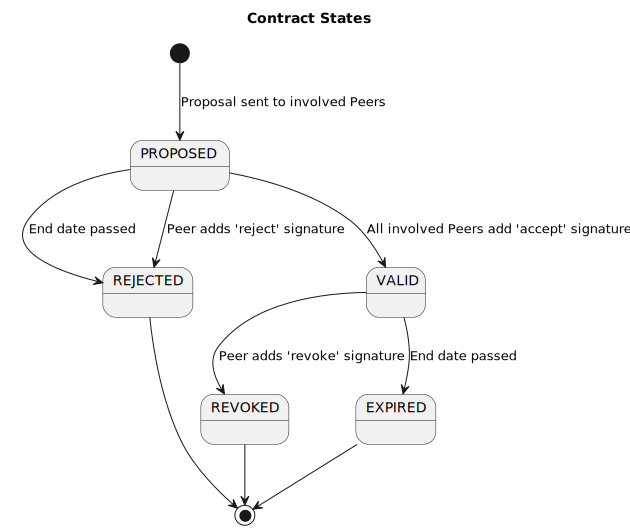
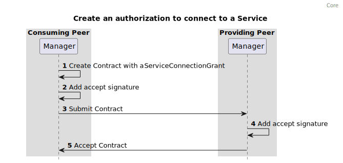
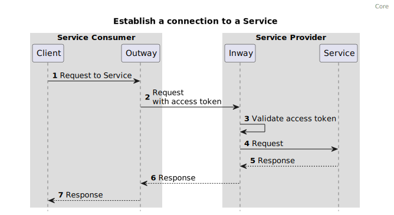

%%%
title = "FSC - core"
abbrev = "FSC - core"
ipr = "trust200902"
submissionType = "IETF"
area = "Internet"
workgroup = ""
keyword = ["Internet-Draft"]

[seriesInfo]
name = "Internet-Draft"
value = "draft-fsc-core-00"
stream = "IETF"
status = "informational"
# date = 2022-11-01T00:00:00Z

[[author]]
initials = "E."
surname = "Hotting"
fullname = "Eelco Hotting"
organization = "Hotting IT"
  [author.address]
   email = "rfc@hotting.it"

[[author]]
initials = "R."
surname = "Koster"
fullname = "Ronald Koster"
organization = "PhillyShell"
  [author.address]
   email = "rfc@phillyshell.nl"

[[author]]
initials = "H."
surname = "van Maanen"
fullname = "Henk van Maanen"
organization = "AceWorks"
  [author.address]
   email = "henk.van.maanen@aceworks.nl"

[[author]]
initials = "N."
surname = "Dequeker"
fullname = "Niels Dequeker"
organization = "ND Software"
  [author.address]
   email = "niels@nd-software.be"

[[author]]
initials = "E."
surname = "van Gelderen"
fullname = "Edward van Gelderen"
organization = "vanG IT"
  [author.address]
   email = "e.van.gelderen@vang.nl"

[[author]]
initials = "P.M."
surname = "Gaemers"
fullname = "Pim Marcel Gaemers"
organization = "apily"
[author.address]
email = "pim.gaemers@apily.dev"

%%%

.# Abstract

TODO

{mainmatter}

# Introduction

This section gives an introduction to this RFC.
Section 2 describes the architecture of a system that follows the FSC specification.
Section 3 describes the interfaces and behavior of FSC components in detail.

## Purpose

The Federated Service Connectivity (FSC) specifications describe a way to implement technically interoperable API gateway functionality, covering federated authentication and secure connecting in a large-scale dynamic API landscape. 

The Core part of the FSC specification achieves inter-organizational, technical interoperability:

- to discover Services.
- to route requests to Services in other contexts (e.g. from within organization A to organization B).
- to request and manage authorizations needed to connect to said Services.

Functionality required to achieve technical interoperability is provided by APIs as specified in this RFC. This allows for automation of most management tasks, greatly reducing the administrative load and enabling up-scaling of inter-organizational usage of services.

## Terminology

This specification lists terms and abbreviations as used in this document.

*Peer:*

Actor that provides and/or consumes Services. This is an abstraction of e.g. an organization, a department or a security context.

*Group:*

System of Peers using Inways, Outways and Managers that confirm to the FSC specification to make use of each other's Services.

*Inway:*

Reverse proxy that handles incoming connections to one or more Services.

*Outway:*

Forward proxy that handles outgoing connections to Inways.

*Contract:*

Agreement between Peers defining what interactions between Peers are possible.

*Grant:*

Defines an interaction between Peers. Grants are part of a Contract. In FSC Core three Grants are described.

1. The PeerRegistrationGrant which specifies the authorization of a Peer to participate as a Peer in the Group.
2. The ServicePublicationGrant which specifies the authorization of a Peer to publish a Service in the Group.
3. The ServiceConnectionGrant which specifies the authorization of a Peer to connect to a Service provided by a Peer.

*Manager:*

The Manager is an API which manages Contracts and acts as an authorization server which provides access tokens.

*Directory:*

A Manager which acts as a Service and Peer discovery point of the Group.

*Service:*

An HTTP API offered to the Group.

*Trust Anchor:*

The Trust Anchor (TA) is an authoritative entity for which trust is assumed and not derived. In the case of FSC, which uses an X.509 architecture, it is the root certificate from which the whole chain of trust is derived.

## Overall Operation of FSC Core

Peers in a Group announce their HTTP APIs to the Group by publishing them as a Service to the Directory. A Group uses a single Directory that defines the scope of the Group. Peers use the Directory to discover what Services and Peers are available in the Group.
Inways of a Peer expose Services to the Group. 
Outways of a Peer connect to the Inway of a Peer providing a Service.
Contracts define the registration of a Peer to the Group, Service publication to the Group and connections between Peers.

Inways are reverse proxies that route incoming connections from Outways to Services.  
Outways are forward proxies that route outgoing connections to Inways.  
Managers negotiate Contracts between Peers.  
Managers provide access tokens which contain the authorization to connect a Service. 
Outways include the access tokens in a requests to Services
The address of an Inway offering a Service is contained in the access token. 
Inways authorize connection attempts by validating access tokens.
Services in the Group can be discovered through the Directory.  
The address of Managers of Peers can be requested from the Directory.  

To connect to a Service, the Peer needs a Contract with a ServiceConnectionGrant that specifies the connection. The FSC Core specification describes how Contracts are created, accepted, rejected and revoked. Once an authorization to connect is granted through a Contract, a connection from HTTP Client to HTTP Service will be authorized everytime an HTTP request to the Service is made.

FSC Core specifies the basics for setting up and managing connections in a Group. It is **RECOMMENDED** to use FSC Core with the following extensions, each specified in a dedicated RFC:

- [FSC Delegation](../delegation/draft-fsc-delegation-00.html), to delegate the right to connect to a service.
- [FSC Logging](../logging/draft-fsc-logging-00.html), keep a log of requests to Services.

### Use cases

A typical use case is a cooperation of many organizations that use APIs to exchange data or provide other business services to each other.

Organizations can participate in multiple Groups at the same time. 
Reasons for participating in multiple Groups could be the use of different environments for production and test deployments or when participating in different ecosystems like health industry and government industry.

An organization can offer the same API in multiple Groups. When doing so, the organization will be a Peer in every Group, and define the API as a Service in the Directory of each Group using a different Inway for each Group.

## Requirements Language

The keywords "MUST", "MUST NOT", "REQUIRED", "SHALL", "SHALL NOT", "SHOULD", "SHOULD NOT", "RECOMMENDED", "NOT RECOMMENDED", "MAY", and "OPTIONAL" in this document are to be interpreted as described in [BCP 14](https://www.rfc-editor.org/info/bcp14) [@!RFC2119] [@!RFC8174] when, and only when, they appear in all capitals, as shown here.

# Architecture

This chapter describes the basic architecture of an FSC system.

## Identity and Trust  {#trustanchor}

Connections between Managers, Inways, Outways use Mutual Transport Layer Security (mTLS) with X.509 certificates. 
Components in the Group are configured to accept the same (Sub-) Certificate Authorities (CA) as Trust Anchors (TA). Each TA is a Trusted Third Party that ensures the identity of the Peers by verifying a set of fields of the subject field [@!RFC5280, section 4.1.2.6] that act as [PeerID](#peer_id) in each X.509 certificate.
When multiple TAs are used the TAs must ensure that the elements of the subject field used to identify a Peer are the same across the TAs. 

!---


!---

## Contract Management

Contracts are negotiated between the Managers of Peers. The Directory provides the address of each Manager.
Connections to Services are authorized by Contracts with ServiceConnectionGrants. To create a new contract, the Manager uses a selection of desired connections as input. (Typically this input comes from a user interface interacting with the Management functionality, see [Registering a Peer](#registering_a_peer)). For each desired connection, a ServiceConnectionGrant is formulated that contains identifying information about both the Outway from the requesting Peer and the Service of the Providing Peer. One Contract may contain multiple Grants. Grants typically match the connections mentioned in a legal agreement like a Data Processing Agreement (DPA). Valid Contracts are used to configure Inways and Outways and enable the possibility to automatically create on demand connections between Peers, as defined in the Grants.

!---


!---

### Contract states

Any Peer can submit a Contract to other Peers. This Contract becomes valid when the Peers mentioned in the Contract accept the Contract by placing an accept signature. 

A Contract becomes invalid when at least one Peer mentioned in the Contract revokes the Contract.

A Contract becomes invalid when at least one Peer mentioned in the Contract rejects the Contract.

Accepting, rejecting and revoking is done by adding a digital signature.

The content of a Contract is immutable. When the content of a Contract is subject to change, the Contract is invalidated and replaced by a new one.

!---


!---

## Registering a Peer {#registering_a_peer}

The Peer registration is required to validate that the Peer meets the requirements set by the Group. In case of FSC Core only an X.509 Certificate signed by the TA is required but extensions on Core might, for example, require the Peer to sign a "Terms of Service" document before allowing a Peer to participate in a Group.

To register, the Peer needs to create a Contract with a [PeerRegistrationGrant](#peer_registration_grant). The PeerRegistrationGrant contains information about the Peer, the address of the Manager of the Peer and the Directory that should accept the registration.

Once the Contract between Peer and Directory is signed by both parties, the Peer is considered a Peer of the Group.

!---


!---

## Service discovery

Every Group is defined by one Directory that contains the Services and Peers in the Group.
Managers register Services by offering Contracts with a [ServicePublicationGrant](#service_publication_grant) to the Directory.

!---


!---

## Create an authorization to connect to a Service

A connection can only be established if the Peer connecting to the Service has a valid Contract containing a [ServiceConnectionGrant](#service_connection_grant) with the Peer providing the Service.
The ServiceConnectionGrant contains information about the Service and the certificate of the Outway that is authorized to connect to the Service.

Once the Contract between providing Peer and consuming Peer is signed by both parties, the connection between Inway and Outway can be established.

!---


!---

## Consuming a Service

A Peer can consume a Service by sending request for said Service to an Outway. 
The Peer obtains an access token from the Manager of the Peer providing the Service. 
The Outway proxies the request including the access token to the Inway.
The Inway will validate the access token and proxy the request to the Service.

!---


!---

# Specifications

## General

## Protocols

The Manager **MUST** support HTTP/1.1[@!RFC9112].

The Manager **MAY** support HTTP/2[@!RFC9113]. 

The protocol used between the Inway and Outway can be either HTTP/1.1[@!RFC9112] or HTTP/2[@!RFC9113]. The protocol is determined by the `protocol` field of a Service as specified in the object `.components/schemas/serviceListingService` of the [OpenAPI Specification](https://gitlab.com/commonground/standards/fsc/-/blob/master/manager.yaml).

### Port configuration

In order to provide a predictable network configuration FSC limits the selection of network ports to be used by components. 
The ports used by FSC components **MUST** be `443` or `8443`. 

Port `443` is **RECOMMENDED** for data traffic i.e. HTTP requests to a Service.  
Port `8443` is **RECOMMENDED** for management traffic i.e. submitting/signing Contracts.  

Data traffic: Inway, Outway  
Management Traffic: Directory, Manager

### Group ID

The Group ID is the identifier of the Group. This identifier is chosen by the Group upon creation of the Group.  
The Group ID **MUST** match the following regular expression `^[a-zA-Z0-9./_-]{1,100}$`

### Peer ID {#peer_id}

Each Peer **MUST** have a unique identifier within the Group, this identifier is called the PeerID. The PeerID is determined by at least one element from the subject field [@!RFC5280, section 4.1.2.6] of an X.509 certificate. Each Group **MUST** define which element(s) of the subject field of the X.509 certificate act as PeerID.
The TA(s) issuing the certificates must ensure that PeerID is always the same for a Peer in each issued certificate for said Peer.    

### Peer name

Each Peer **MUST** have a human-readable name which can be used to identify a Peer. Unlike the PeerID the name does not have to be unique. The name of Peer is determined by an element in the subject field [@!RFC5280, section 4.1.2.6] of an X.509 certificate. The Group **MUST** define which element of the subject field is used.

### TLS configuration

Connections between Inways, Outways, Managers of a Group are mTLS connections based on X.509 certificates as defined in [@!RFC5280].

The certificates must be provided by a TA who **SHOULD** validate a Peers identity, i.e. the TA **MUST** preform Organization Validation. 

The certificate guarantees the identity of a Peer.

Each Group can have multiple TAs.

Every Peer in a Group **MUST** accept the same TA(s).

FSC places specific requirements on the subject fields of a certificate. [@!RFC5280, section 4.1.2.6] which are listed below

- Subject Alternative Name[@!RFC5280, section 4.2.1.6]: This should contain the Fully Qualified Domain Names (FQDN) of a Manager, Inway or Outway. For an Outway this FQDN does not have to resolve externally.
- Subject Organization: This should contain to the name of the Organization.

The representation and verification of domains specified in the X.509 certificate **MUST** adhere to [@!RFC6125] 

#### Certificate thumbprints {#certificate_thumbprints}

Certificate thumbprints used within the scope of FSC are always part of a X.509 certificate. Certificate thumbprints **MUST** be created as described in [@!RFC7515, section 4.1.8].

###  Error Handling {#error_handling}

The Inway and Outway both have a single endpoint which proxies HTTP requests. 
In case of an error within the scope of FSC these components **MUST** return the HTTP header `Fsc-Error-Code` which **MUST** contain the code specifying the error. 

The response body must contain an object as described in `.components/schemas/error` of the [OpenAPI Specification](https://gitlab.com/commonground/standards/fsc/-/blob/master/manager.yaml).  

The HTTP status codes that **MUST** be used in combination with the HTTP header `Fsc-Error-Code` are defined in the sections 3.7.1.4 and 3.8.2.2.

## Contracts

The content of a Contract is defined in the object `.components/schemas/contractContent` of the [OpenAPI Specification](./manager.yaml)

### Contract Validation {#contract_validation}

- A Contract ID is provided as a UUID V7 in the field `contract.id`. 
- A hash algorithm is provided in the field `contract.content.hash_algorithm`.
- The date provided in `contract.content.created_at` can not be in the future.
- The Group ID of the Manager matches the Group ID defined in the field `contract.group_id`.
- A valid date is provided in `contract.content.validity.not_before`. 
- A valid date is provided in `contract.content.validity.not_after`.
- The date provided in `contract.content.validity.not_after` must be greater than the date provided in the field `contract.validity.not_before`.
- The date provided in `contract.content.validity.not_after` must be in the future.
- At least one Grant is set in the field `contract.content.grants`.
- A `PeerRegistrationGrant` cannot be mixed with other Grants.
- Only one `PeerRegistrationGrant` is allowed per Contract.
- A `ServicePublicationGrant` cannot be mixed with other Grants.

Per Grant type different validation rules apply.

#### PeerRegistrationGrant {#peer_registration_grant}

The content of a PeerRegistrationGrant is defined in the object `.components/schemas/grantPeerRegistration` of the [OpenAPI Specification](https://gitlab.com/commonground/standards/fsc/-/blob/master/manager.yaml)

Validation rules:  

- The Peer ID provided by the X.509 certificate used by the Manager of the Directory matches the value of the field `grant.data.directory.peer_id`
- The Peer ID provided by the X.509 certificate used by the Manager offering the Contract to the Directory matches the value of the field `grant.data.peer.id`
- The subject organization of the X.509 certificate used by the Manager offering the Contract to the Directory matches the value of the field `grant.data.peer.name`

Signature requirements:  

- A signature is present with the Peer ID of the Peer defined in the field `grant.data.directory.peer_id`
- A signature is present with the Peer ID of the Peer defined in the field `grant.data.peer.id`

#### ServicePublicationGrant {#service_publication_grant}

The content of a ServicePublicationGrant is defined in the object `.components/schemas/grantServicePublication` of the [OpenAPI Specification](https://gitlab.com/commonground/standards/fsc/-/blob/master/manager.yaml)

Validation rules:

- The Peer ID provided by the X.509 certificate used by the Manager of the Directory Peer matches the value of the field `grant.data.directory.peer_id`
- The Peer ID provided by the X.509 certificate used by the Manager offering the Contract to the Directory matches the value of the field `grant.data.service.peer_id`
- A Service name which matches the regular expression `^[a-zA-Z0-9-._]{1,100}$` is provided in the field  `grant.data.service.name` 

Signature requirements:  

- A signature is present with the Peer ID of the Peer defined in the field `grant.data.directory.peer_id`
- A signature is present with the Peer ID of the Peer defined in the field `grant.data.service.peer_id`

#### ServiceConnectionGrant {#service_connection_grant}

The content of a ServiceConnectionGrant is defined in the object `.components/schemas/grantServiceConnection` of the [OpenAPI Specification](https://gitlab.com/commonground/standards/fsc/-/blob/master/manager.yaml)

Validation rules:

- The Peer ID provided by the X.509 certificate used by the Manager of the Peer providing the Service matches the value of the field `grant.data.service.peer_id`
- The Peer ID provided by the X.509 certificate used by the Manager offering the Contract to the Service providing Peer matches the value of the field `grant.data.outway.peer_id`
- The Service provided in the field `grant.data.service.name` is offered by the Peer provided in the field `grant.data.service.peer_id`
- A Certificate thumbprint is provided in the field `grant.data.outway.certificate_thumbprint`

Signature requirements:

- A signature is present with the Peer ID of the Peer defined in the field `grant.data.outway.peer_id`
- A signature is present with the Peer ID of the Peer defined in the field `grant.data.service.peer_id`

### Signatures {#signatures}

A signature **MUST** follow the JSON Web Signature (JWS) format specified in [@!RFC7515]

A signature on a Contract **SHOULD** only be accepted if the Peer is present in one of the Grants as:

*PeerRegistrationGrant*

- `grant.data.directory.peer_id`
- `grant.data.peer.id`

*ServiceConnectionGrant*

- `grant.data.outway.peer_id`
- `grant.data.service.peer_id`

*ServicePublicationGrant*

- `grant.data.directory.peer_id`
- `grant.data.service.peer_id`

The JWS **MUST** specify the certificate thumbprint of the keypair used to create the digital signature using the `x5t#S256`[@!RFC7515, section 4.1.8] field of the `JOSE Header` [@!RFC7515, section 4].

The JWS **MUST** use the JWS Compact Serialization described in [@!RFC7515, section 7.1]

The JWS **MUST** be created using one of the following digital signature algorithms:

* RS256
* RS384
* RS512
* ES256
* ES384
* ES512

The JWS Payload as defined in [@!RFC7515, section 2], **MUST** contain a hash of the `contract.content` as described in the section [Content Hash](#content_hash), one of the signature types described in the [signature type section](#signature_types) and a Unix timestamp of the sign date.

JWS Payload example:
```JSON
{
  "contract_content_hash": "--------",
  "type": "accept",
  "signed_at": 1672527600
}
```

#### Payload fields

- `contract_content_hash`, hash of the content of the contract.
- `type`, type of signature.
- `signed_at` Unix timestamp of the sign date.

##### Signature types {#signature_types}

- `accept`, Peer has accepted the contract
- `reject`, Peer has rejected the contract
- `revoke`, Peer has revoked the contract

### The content hash {#content_hash}

A Peer should ensure that a Contract signature is intended for the Contract.
Validation is done by comparing the hash of the received Contract with the hash in the signature.

The `contract_content_hash` of the signature payload contains the signature hash. The algorithm to create a `contract_content_hash` is described below.

1. Create a byte array called `contentBytes`.
1. Convert `contract.content.group_id` to bytes and append the bytes to `contentBytes`.
1. Append `contract.content.id` to `contentBytes`.
1. Convert `contract.content.validity.not_before` to bytes and append the bytes to `contentBytes`.
1. Convert `contract.content.validity.not_after` to bytes and append the bytes to `contentBytes`.
1. Convert `contract.content.created_at` to bytes and append the bytes to `contentBytes`.
1. Create an array of bytes arrays called `grantByteArrays`
1. For each Grant in `contract.content.grants`
   1. Create a Grant Hash for the Grant as documented in the [Grant Hash section](#grant_hash).
   1. Convert the Grant Hash from string to bytes and store them in a byte array named `grantBytes`.
   1. Append `grantBytes` to `grantByteArrays`.
1. Sort the byte arrays in `grantByteArrays` in ascending order.
1. Append the bytes of `grantByteArrays` to `contentBytes`.
1. Hash the `contentBytes` using the hash algorithm described in `contract.content.algorithm`.
1. Encode the bytes of the hash using Base64 URL encoding with all trailing '=' characters omitted and without the inclusion of any line breaks, whitespace, or other additional characters.
1. Convert the value of `contract.content.algorithm` to an int32 and surround it with dollar signs (`$`). When using the `SHA3-512` algorithm this would result in `$1$`. 
   To convert the hash algorithm to an integer look up the enum value in the field `.components.schemas.HashAlgorithm` of [the OpenAPI Specification](https://gitlab.com/commonground/standards/fsc/-/blob/master/manager.yaml) and interpret the position in the list. E.g. The enum `HASH_ALGORITHM_SHA3_512` is the first item in the list so its integer is 1.
1. Add `1$` as suffix to the string created in step 13. This is the enum `HASH_TYPE_CONTRACT` as defined in the field `.components.schemas.HashType` of [the OpenAPI Specification](https://gitlab.com/commonground/standards/fsc/-/blob/master/manager.yaml) as int32. If the string created in step 13 is `$1$`, the result should now be `$1$1$`
1. Add the Base64 generated in step 12 as suffix to the string generated in step 14.

#### Data types {#data_types}

- `int32`: use `Little-endian` as endianness when converting to a byte array
- `int64`: use `Little-endian` as endianness when converting to a byte array
- `string`: use `utf-8` encoding when converting to a byte array

### Grant hash {#grant_hash}

The Grant hash can be created by executing the following steps:

1. Create a byte array named `grantBytes`
1. Convert `contract.content.group_id` to bytes and append the bytes to `grantBytes`.
1. Convert `contract.content.id` to bytes and append the bytes to `grantBytes`.
1. Convert the value of each field of the Grant to bytes and append the bytes to the `grantBytes` in the same order as the fields are defined in [the OpenAPI Specification](https://gitlab.com/commonground/standards/fsc/-/blob/master/manager.yaml).  
   Except for the field `type`. This field must be omitted.
1. Hash the `grantBytes` using the hash algorithm described in `contract.content.algorithm`
1. Encode the bytes of the hash using Base64 URL encoding with all trailing '=' characters omitted and without the inclusion of any line breaks, whitespace, or other additional characters.
1. Convert the value of `contract.content.algorithm` to an int32 and enclose it with `$`. To convert the hash algorithm to an integer take the enum value of `HashAlgorithm` defined in [the OpenAPI Specification](https://gitlab.com/commonground/standards/fsc/-/blob/master/manager.yaml). E.g. The enum `HASH_ALGORITHM_SHA3_512` becomes `$1$`.
1. Determine the `HashType` that matches with value of `Grant.type` and convert it to an int32 and add a `$` as suffix. To convert the `HashType` to an integer take the position of the `HashType` in the field `.components.schemas.HashType` defined in [the OpenAPI Specification](https://gitlab.com/commonground/standards/fsc/-/blob/master/manager.yaml)). E.g. The enum `HASH_TYPE_GRANT_PEER_REGISTRATION` becomes `2$`.
1. Combine the strings containing the hash algorithm (step 6) and Hash type (step 7). E.g. The hash algorithm `HASH_ALGORITHM_SHA3_512` and Grant Type `GRANT_TYPE_PEER_REGISTRATION` should result in the string `$1$2$`
1. Prefix the Bas64 string generated in step 5 with the string generated in step 8.

## Access token {#access_token}

The access token is a JSON Web Token (JWT) as specified in [@!RFC7519]

The JWT **MUST** specify the thumbprint of the X.509 certificate used to sign the JWT using the `x5t#S256`[@!RFC7515, section 4.1.8] field of the `JOSE Header` [@!RFC7515, section 4].

The JWT **MUST** be created using one of the following digital signature algorithms:

* RS256
* RS384
* RS512
* ES256
* ES384
* ES512

The access token is a certificate-bound access token as specified in [@!RFC8705, section 3]

### JWT Payload

The payload of the JWT **MUST** contain the field specified below:

* *gth(string):*  
  The hash of the Grant that serves as basis for the authorization
* *gid(string):*
  The ID of the Group
* *sub(string):*
  The subject [@!RFC7519, section 4.1.2]. This should be the ID of the Peer for whom the token is intended 
* *iss(string):*
  The issuer [@!RFC7519, section 4.1.1]. The ID of the Peer who issued the token. I.e. the Peer who is offering the Service
* *svc(string):*
  Name of the Service
* *aud(string):*
  The audience [@!RFC7519, section 4.1.3]. This should be URI[@!RFC3986] of the Inway providing the Service. The URI is a URL that **MUST** contain the scheme and port number used by the Inway
* *exp(int):*
  Expiration time [@!RFC7519, section 4.1.4]
* *nbf(int):*
  Not before [@!RFC7519, section 4.1.5]
* *cnf(object):*
    * *x5t#S256(string):*
    The thumbprint of the certificate that is allowed ot use the access token
* *add(object):*
  An object which can be used to provide additional data 

Example payload:

```json
{
    "gth": "$1$4$+PQI7we01qIfEwq4O5UioLKzjGBgRva6F5+bUfDlKxUjcY5yX1MRsn6NKquDbL8VcklhYO9sk18rHD6La3w/mg",
    "gid": "fsc.group.example.id",
    "sub": "1234567890",
    "iss": "1234567891",
    "svc": "serviceName", 
    "aud": "https://inway.com",
    "exp": 1493726400,
    "nbf": 1493722800,
    "cnf": {
      "x5t#S256": "DpAyDYakmVAQ4oOJC3UYLRk/ONRCqMj00TeGJemMiLA"
    },
    "add": {}
}
```

## Manager {#manager}

The Manager is responsible for:

- Receiving Contracts
- Validating Contracts
- Receiving Contract signatures (accept, reject, revoke)
- Validating Contract signatures
- Providing the X.509 certificates of the keypair of which the private key was used by the Peer to create signatures
- Providing Contracts involving a specific Peer
- Providing access tokes 
- Listing Peers
- Listing Services

It is **RECOMMENDED** to implement the Manager functionality separate from the Inway functionality, in order to be able to have multiple Inways that are configured by one Manager.

### Behavior

#### Authentication

The Manager **MUST** only accept mTLS connections from other external Managers with an X.509 certificate that is signed by the TA of the Group.

#### Contracts

The Manager **MUST** support Contracts containing Grants of the type PeerRegistrationGrant, ServicePublicationGrant and ServiceConnectionGrant.

The Manager **MUST** validate Contracts using the rules described in [Contract validation section](#contract_validation)

The Manager **MUST** persist the Peer ID, name and Manager address of each Peer with whom the Peer has negotiated Contracts.

It is **RECOMMENDED** to implement a retry and backoff mechanism in case the contract propagation fails.

#### Signatures

The Manager **MUST** validate the signature according to the rules described in the [signature section](#signature).

The Manager **MUST** generate an error response if a signature is invalid.

The Manager **MUST** propagate the signature to each of the Peers in the Contract when the Peer signs the Contract.

It is **RECOMMENDED** to implement a retry and backoff mechanism in case the signature propagation fails.

#### Providing X.509 certificates

The Manager **MUST** provide X.509 certificates of the keypairs used to sign Contracts and access tokens.

The Manager **MUST** provide the complete certificate chain excluding the root CA certificate used by the Group as Thrust Anchor.

#### Providing contracts

The Manager **MUST** provide existing Contracts for a specific Peer. A Contract **SHOULD** only be provided to a Peer if the Peer is present in one of the Grants of the Contract.

#### Tokens

The Manager **MUST** be able to provide an [access token](#access_token) to Peers that have a valid Contract containing a ServiceConnectionGrant.

Before issuing an access token the Manager **MUST** validate that:

1. A valid Contract exists with a ServiceConnectionGrant matching the Grant hash in the access token request.
1. The Manager is provided by a Peer with the same PeerID as specified in `grant.data.service.peer_id`.
1. The Manager is provided by a Peer who has an Inway which is offering the Service specified in `grant.data.service.name`. 
1. The Peer ID provided by the X.509 certificate used by the component requesting the access token matches the value of the field `grant.data.outway.peer_id`.

The Manager **MUST** include the address of the Inway in the field `aud` of the access token.

#### Service listing

The Manager **MUST** list a Service when a valid Contract containing a ServicePublicationGrant for the Service exists.

#### Peer listing

The Manager **MUST** list the Peers with whom the Peer has negotiated Contracts or who announced themselves to the Peer.

The Manager **MUST** persist the Peer ID, name and Manager address of each Peer with whom the Peer has negotiated Contracts.

The Manager **MUST** persist the Peer ID, name and Manager address of each Peer who called the `announce`  endpoint as specified in the [OpenAPI Specification](https://gitlab.com/commonground/standards/fsc/-/blob/master/manager.yaml).

### Interfaces {#manager_interface}

The Manager functionality **MUST** implement an HTTP interface as specified in the [OpenAPI Specification](https://gitlab.com/commonground/standards/fsc/-/blob/master/manager.yaml).  

###  FSC manager address 

The Manager is required to include its public address as HTTP Header `Fsc-Manager-Address` in each POST or PUT request sent to another Manager.

### Error response

The Manager implements two error formats 

#### OAuth 2.0 error response

The `/token` endpoint **MUST** return an error response as described in [@!RFC6749, section 5.2].

#### Other endpoints

The Manager **MUST** return the error response object as described in `.components/schemas/error` of the [OpenAPI Specification](https://gitlab.com/commonground/standards/fsc/-/blob/master/manager.yaml).

The code field of the error response **MUST** contain one of the codes defined as `.components.schemas.ManagerErrorCode` in the [OpenAPI Specification](https://gitlab.com/commonground/standards/fsc/-/blob/master/manager.yaml).  

The domain field of the error response **MUST** be equal to `ERROR_DOMAIN_MANAGER`.  

#### Codes

| Error code                                          | HTTP status code | Description                                                                                                                                         |
|-----------------------------------------------------|------------------|-----------------------------------------------------------------------------------------------------------------------------------------------------|
| ERROR_CODE_INCORRECT_GROUP_ID                       | 422              | The Group ID in the Contract does not match the GroupID of the receiving Manager                                                                    |
| ERROR_CODE_PEER_NOT_PART_OF_CONTRACT                | 422              | The Peer tried to submit or sign a Contract without being a Peer on the Contract                                                                    |
| ERROR_CODE_SIGNATURE_CONTRACT_CONTENT_HASH_MISMATCH | 422              | The Peer tried to submit a signature with a Contract content hash that does not match the Contract                                                  |
| ERROR_CODE_PEER_CERTIFICATE_VERIFICATION_FAILED     | 400              | The Peer provided a x.509 certificate signed by the thrust anchor of the Group but the content is invalid. E.g the Peer ID is in a incorrect format |
| ERROR_CODE_PEER_ID_SIGNATURE_MISMATCH               | 422              | The Peer submitted a signature that includes a Peer ID that does not match the ID of the submitting Peer                                            |
| ERROR_CODE_SIGNATURE_VERIFICATION_FAILED            | 422              | The Peer submitted a signature that could not be verified                                                                                           |
| ERROR_CODE_GRANT_COMBINATION_NOT_ALLOWED            | 422              | The Peer submitted a Contract with a combination of Grants that is not allowed                                                                      |
| ERROR_CODE_URL_PATH_CONTENT_HASH_MISMATCH           | 422              | The Content Hash in the URL path does not match the Content Hash generated from the Contract Content in the request body                            |
| ERROR_CODE_UNKNOWN_HASH_ALGORITHM_HASH              | 422              | The Hash Algorithm in the Contract Content hash or Grant Hash is not supported                                                                      |
| ERROR_CODE_UNKNOWN_ALGORITHM_SIGNATURE              | 422              | The Algorithm in the Signature is not supported                                                                                                     |

## Directory

### Behavior

#### Authentication

The Directory **MUST** only accept connection from clients that use mTLS, the client **MUST** use an X.509 certificate that is signed by the TA of the Group.

#### Peer registration

Peer registration is accomplished by offering a Contract to the Directory which contains a PeerRegistrationGrant.

The Directory **MUST** be able to sign Contracts with Grants of the type PeerRegistrationGrant.

The Directory **MUST** validate the PeerRegistrationGrants in the Contract using the rules described in [PeerRegistrationGrant section](#peer_registration_grant)

#### Service publication

Service publication is accomplished by offering a Contract to the Directory which contains one or more ServicePublicationGrants with each ServicePublicationGrant containing a single Service. Once the Directory and the Peer offering the Service have both signed the Contract, the Service is published in the Directory.

The Directory **MUST** be able to sign Contracts with Grants of the type ServicePublicationGrant.

The Directory **MUST** validate the ServicePublicationGrant in the Contract using the rules described in [ServicePublicationGrant section](#peer_service_publication)

The Directory **MUST** only accept ServicePublicationGrants of Peers which have a valid Contract with a PeerRegistrationGrant containing the Peer and the Directory.

Although multiple ServicePublicationGrants are allowed in a single Contract it is **RECOMMENDED** to limit this to one per Contract.

## Outway

### Behavior

#### Authentication

The Outway **MUST** use mTLS when connecting to Inways with an X.509 certificate signed by the chosen TA of the Group.

#### Routing

The Outway **MUST** proxy the request to the address of the Inway specified in the field `aud` of the access token.

The Outway **MUST** use an [access token](#access_token) provided by the Peer specified in the `grant.data.service.peer_id` field of the ServiceConnectionGrant.

The Outway **MUST** include an access token in the HTTP header `Fsc-Authorization` when proxying the HTTP request to the Inway.  

The Outway **MUST** validate that the Group ID specified in the claim `gid` of the access token matches the Group ID of the Outway.

The Outway **MUST NOT** alter the path of the HTTP Request.

Clients **MAY** use TLS when communicating with the Outway.

#### Obtaining access tokens

Access tokens are obtained using the Client Credentials flow[@!RFC6749, section 4.4].

Access tokens **MUST** be obtained by calling the `/token` endpoint defined in the [OpenAPI Specification](https://gitlab.com/commonground/standards/fsc/-/blob/master/manager.yaml

Which component obtains an access token for a Service is an implementation detail and out of scope for this document.

#### Error response

If the Error has occurred in the Inway or Service the Outway **MUST** return the error without altering the response. 

The Outway **MUST** return an error response defined in the [Error handling section](#error_handling) when the error is produced by the Outway.

The code field of the error response **MUST** contain one of the codes defined as `.components.schemas.OutwayErrorCode` in the [OpenAPI Specification](https://gitlab.com/commonground/standards/fsc/-/blob/master/manager.yaml).

The domain field of the error response **MUST** be equal to `ERROR_DOMAIN_OUTWAY`.

##### Codes

| Error code                          | HTTP status code | Description                                                                                                   |
|-------------------------------------|-----------------|---------------------------------------------------------------------------------------------------------------|
| ERROR_CODE_METHOD_UNSUPPORTED       | 405             | The Outway received a request with an HTTP Method that is not supported. The CONNECT method is not supported. |

## Inway

### Behavior

#### Authentication

The Inway **MUST** only accept connections from Outways using mTLS with an X.509 certificate signed by the chosen TA of the Group.

#### Authorization

The Inway **MUST** validate the access token provided in the HTTP `Fsc-Authorization`.   

The request **MUST** be authorized if the access token meets the following conditions:  

- The access token is signed by the same Peer that owns Inway.
- The access token is used by an Outway that uses the X.509 certificate to which the access token is bound. This is verified by applying the JWT Certificate Thumbprint Confirmation Method specified in [@!RFC8705,section 3.1].
- The Service specified in the access token is known to the Inway.
- The Group ID specified in the claim `gid` of the access token matches the Group ID of the Inway.

#### Routing

The HTTP request **MUST** contain the HTTP Header `Fsc-Authorization` which contains the access token obtained by the Outway.

The Inway **MUST** proxy the HTTP request to the Service specified in the field `svc` of the access token.

The Inway **MUST** not delete the HTTP Header `Fsc-Authorization` from the HTTP Request before forwarding the request to the Service.

### Interfaces

#### Proxy Endpoint

The HTTP endpoint `/` **MUST** be implemented.

#### Error response

The Inway **MUST** return the error response of a Service to the Outway without altering the response.

The Inway **MUST** return an error response defined in the [Error handling section](#error_handling) when the error is produced by the Inway.

The code field of the error response **MUST** contain one of the codes defined as `.components.schemas.InwayErrorCode` in the [OpenAPI Specification](https://gitlab.com/commonground/standards/fsc/-/blob/master/manager.yaml).

The domain field of the error response **MUST** be equal to `ERROR_DOMAIN_INWAY`.

##### Codes

| Error code                         | HTTP status code | Description                                                                                                                                           |
|------------------------------------|------------------|-------------------------------------------------------------------------------------------------------------------------------------------------------|
| ERROR_CODE_ACCESS_TOKEN_MISSING    | 401              | The HTTP header `Fsc-Authorization` does not contain an access token. In this scenario the HTTP header `WWW-Authenticate` **MUST** be set to `Bearer` |
| ERROR_CODE_ACCESS_TOKEN_INVALID    | 401              | The provided access token is invalid. In this scenario the HTTP header `WWW-Authenticate` **MUST** be set to `Bearer`                                 |
| ERROR_CODE_ACCESS_TOKEN_EXPIRED    | 401              | The provided access token has expired. In this scenario the HTTP header `WWW-Authenticate` **MUST** be set to `Bearer`                                |
| ERROR_CODE_WRONG_GROUP_ID_IN_TOKEN | 403              | The Group ID specified in the access token does not match the ID of the Group of the Inway                                                            |
| ERROR_CODE_SERVICE_NOT_FOUND       | 404              | The Service specified in the access token is not offered by the Inway                                                                                 |
| ERROR_CODE_SERVICE_UNREACHABLE     | 502              | The Inway is unable to reach the Service                                                                                                              |

# References

[OpenAPI Specification](https://gitlab.com/commonground/standards/fsc/-/blob/master/manager.yaml)

# Acknowledgements

{backmatter}
